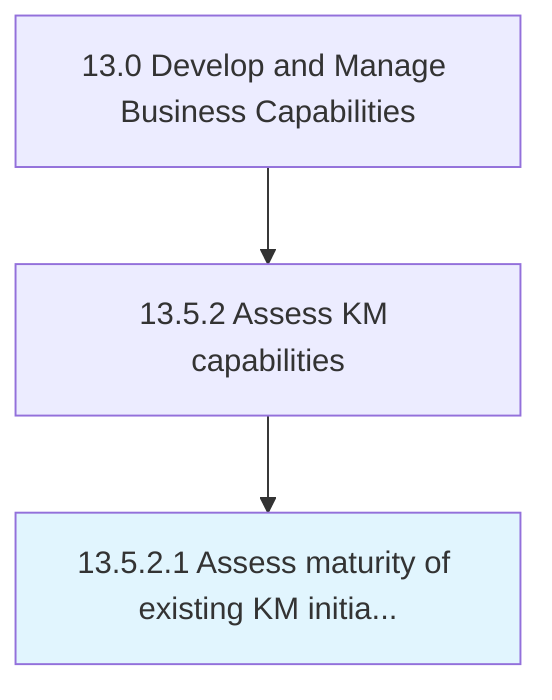

# Assess maturity of existing KM initiatives

> Evaluating if initiatives are effective or should be discarded.

## Overview

Activity 13.5.2.1 is an activity within the Develop and Manage Business Capabilities framework. 

Evaluating if initiatives are effective or should be discarded. Design a framework for assessing maturity, typically from Level 1 (undefined), Level 2 (repeatable), Level 3 (defined), and Level 4 (managed) through Level 5 (optimized).

## Process Hierarchy



## Key Statistics

| Metric | Value |
|--------|-------|
| APQC Code | 11110 |
| Hierarchy ID | 13.5.2.1 |
| Level | Activity |
| Parent | [13.5.2](../) |
| Sub-Processes | 0 |


## GraphDL Semantic Structure

```
assess.Maturity.of.ExistingKMInitiatives
```

| Component | Value | Description |
|-----------|-------|-------------|
| Verb | `assess` | Primary action |
| Object | `maturity` | Direct object |
| Preposition | `of` | Relationship |
| PrepObject | `existing KM initiatives` | Indirect object |


## Related Concepts

- [Maturity](/concepts/Maturity)
- [ExistingKmInitiatives](/concepts/ExistingKmInitiatives)


---

*Source: APQC PCF 11110 (13.5.2.1) - APQC*
