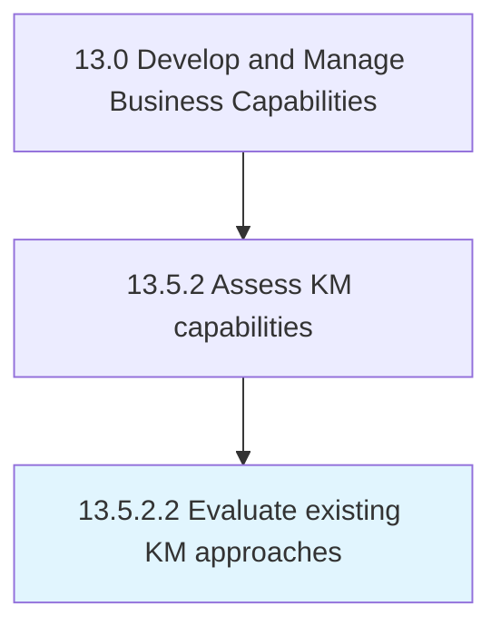

# Evaluate existing KM approaches

> Evaluating existing procedures, policies, and guidelines for knowledge management.

## Overview

Activity 13.5.2.2 is an activity within the Develop and Manage Business Capabilities framework. 

Evaluating existing procedures, policies, and guidelines for knowledge management. Study and examine the organization's approach against industry best practices by benchmarking, competitive analysis, etc.

## Process Hierarchy



## Key Statistics

| Metric | Value |
|--------|-------|
| APQC Code | 11111 |
| Hierarchy ID | 13.5.2.2 |
| Level | Activity |
| Parent | [13.5.2](../) |
| Sub-Processes | 0 |


## GraphDL Semantic Structure

```
evaluate.ExistingKMApproaches
```

| Component | Value | Description |
|-----------|-------|-------------|
| Verb | `evaluate` | Primary action |
| Object | `existing KM approaches` | Direct object |


## Related Concepts

- ExistingKmApproaches


---

*Source: APQC PCF 11111 (13.5.2.2) - APQC*
