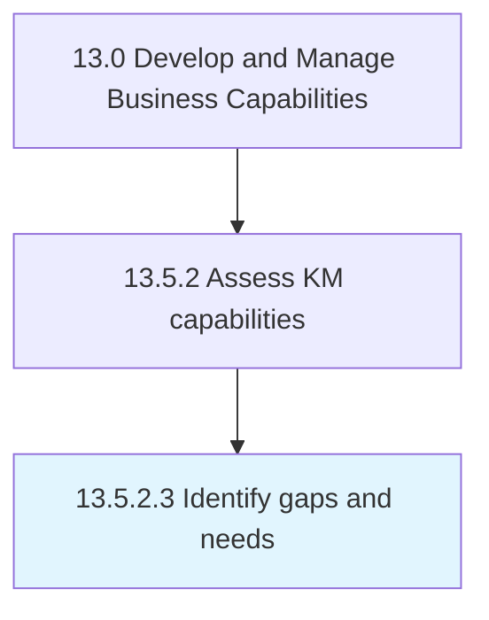

# Identify gaps and needs

> Assessing the KM approach evaluations in order to identify any gaps or needs.

## Overview

Activity 13.5.2.3 is an activity within the Develop and Manage Business Capabilities framework. 

Assessing the KM approach evaluations in order to identify any gaps or needs. Compare the performance of the KM approach against the desired or expected performance, as well as against the standard knowledge management industry approach.

## Process Hierarchy



## Key Statistics

| Metric | Value |
|--------|-------|
| APQC Code | 11112 |
| Hierarchy ID | 13.5.2.3 |
| Level | Activity |
| Parent | [13.5.2](../) |
| Sub-Processes | 0 |


## GraphDL Semantic Structure

```
identify.GapsAndNeeds
```

| Component | Value | Description |
|-----------|-------|-------------|
| Verb | `identify` | Primary action |
| Object | `gaps and needs` | Direct object |


## Related Concepts

- Gaps
- Needs


---

*Source: APQC PCF 11112 (13.5.2.3) - APQC*
