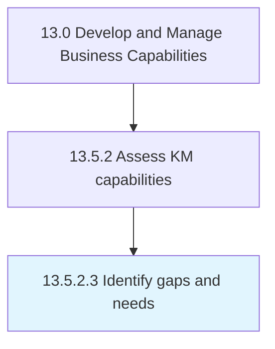
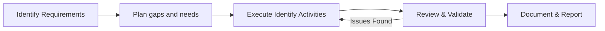

# Identify gaps and needs

> Assessing the KM approach evaluations in order to identify any gaps or needs.

## Overview

The identify gaps and needs process is a critical component of the Business Capabilities function within an organization. It encompasses the systematic approach to identify gaps and needs, ensuring that all activities are performed consistently, efficiently, and in alignment with organizational objectives. This process establishes the framework through which identify gaps and needs is executed, monitored, and continuously improved to deliver value across the enterprise.

Within the APQC Process Classification Framework (hierarchy 13.5.2.3), this activity supports the broader "Develop and Manage Business Capabilities" category. Effective execution requires cross-functional collaboration, clear accountability, and robust governance mechanisms. Organizations that mature this process typically see improved operational performance, reduced risk exposure, and stronger alignment between tactical activities and strategic goals.


## Process Hierarchy



## Key Statistics

| Metric | Value |
|--------|-------|
| APQC Code | 11112 |
| Hierarchy ID | 13.5.2.3 |
| Level | Activity |
| Parent | [13.5.2](../) |
| Sub-Processes | 0 |


## GraphDL Semantic Structure

```
identify.GapsAndNeeds
```

| Component | Value | Description |
|-----------|-------|-------------|
| Verb | `identify` | Primary action |
| Object | `gaps and needs` | Direct object |


## Process Flow



## RACI Matrix

| Activity | Analyst | Manager | Specialist | Manager |
|----------|------|------|------|------|
| Planning & Scoping | R | A | C | I |
| Execution | A | C | I | R |
| Review & Approval | C | I | R | A |
| Reporting | I | R | A | C |

## Related Occupations

- [Business Process Analyst](/occupations/BusinessProcessAnalyst)
- [Quality Manager](/occupations/QualityManager)
- [Change Management Specialist](/occupations/ChangeManagementSpecialist)
- [Continuous Improvement Manager](/occupations/ContinuousImprovementManager)

## Related Departments

- Business Excellence
- Quality Assurance
- Organizational Development

## Industry Variations

### Manufacturing

Lean Six Sigma deployment, total quality management, production capability maturity, and operational excellence programs.

### Consulting

Knowledge management systems, methodology development, capability benchmarking, and best practice dissemination frameworks.

### Retail

Omnichannel capability development, customer experience optimization, supply chain agility improvements, and workforce capability building.

## KPIs & Metrics

| KPI | Target | Measurement Frequency |
|-----|--------|----------------------|
| Process Maturity Score | > Level 3 | Annually |
| Improvement Initiative ROI | > 150% | Per Initiative |
| Knowledge Asset Utilization | > 70% | Quarterly |
| Capability Gap Closure Rate | > 80% | Semi-Annually |

## Related Concepts

- Gaps
- Needs


---

*Source: APQC PCF 11112 (13.5.2.3) - APQC*
