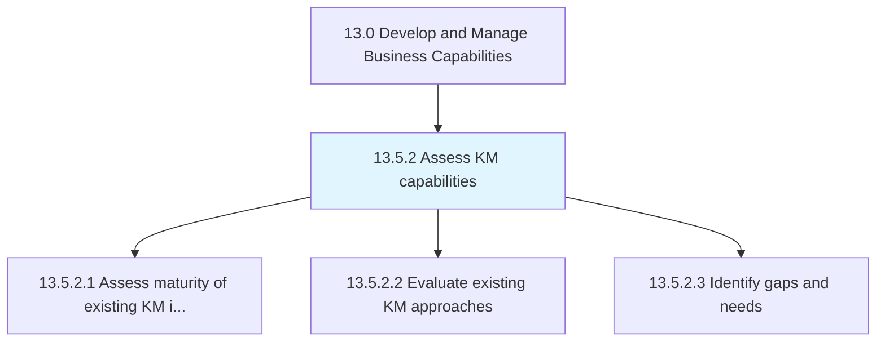
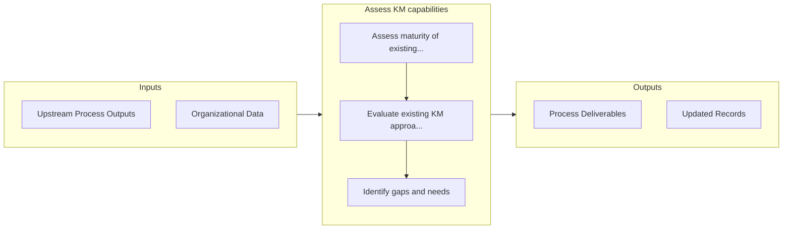

# Assess KM capabilities

> Assessing the maturity of the existing initiatives in knowledge management, and evaluating existing KM approaches.

## Overview

Process 13.5.2 is a core process that defines the specific procedures for assess km capabilities. 

Assessing the maturity of the existing initiatives in knowledge management, and evaluating existing KM approaches. Identify the gaps and needs in order to enhance the existing KM approaches. Develop and implement new KM approaches.

## Process Hierarchy



## Key Statistics

| Metric | Value |
|--------|-------|
| APQC Code | 11096 |
| Hierarchy ID | 13.5.2 |
| Level | Process |
| Parent | [13.5](../) |
| Sub-Processes | 3 |


## GraphDL Semantic Structure

```
assess.KMCapabilities
```

| Component | Value | Description |
|-----------|-------|-------------|
| Verb | `assess` | Primary action |
| Object | `KM capabilities` | Direct object |


## Process Flow



## Sub-Processes

| Process | Hierarchy ID | Description |
|---------|-------------|-------------|
| [Assess maturity of existing KM initiatives](./AssessMaturityOfExistingKMInitiatives) | 13.5.2.1 | Evaluating if initiatives are effective or should be discarded |
| [Evaluate existing KM approaches](./EvaluateExistingKMApproaches) | 13.5.2.2 | Evaluating existing procedures, policies, and guidelines for knowledge management |
| [Identify gaps and needs](./IdentifyGapsAndNeeds) | 13.5.2.3 | Assessing the KM approach evaluations in order to identify any gaps or needs |


## Related Concepts

- KmCapabilities


---

*Source: APQC PCF 11096 (13.5.2) - APQC*
