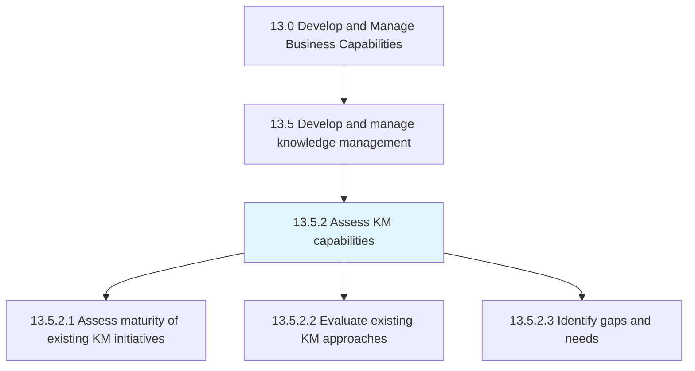
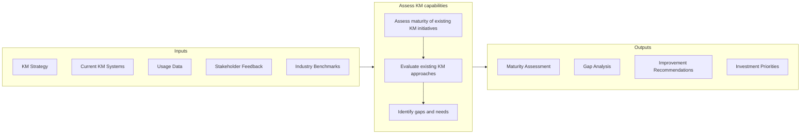

# Assess KM capabilities

> Assessing the maturity of the existing initiatives in knowledge management, and evaluating existing KM approaches.

## Overview

Process 13.5.2 is a core process that defines the specific procedures for assessing knowledge management (KM) capabilities. This process provides a systematic approach to evaluating the effectiveness of existing knowledge management initiatives, identifying gaps, and prioritizing improvements.

Knowledge management capability assessment examines multiple dimensions: the maturity of existing KM initiatives, the effectiveness of current approaches and technologies, and the gaps between current state and desired future state. This assessment informs strategic decisions about KM investments and helps prioritize improvement efforts.

Effective KM capability assessment requires understanding both the technical infrastructure (systems, tools, repositories) and the human and cultural factors (sharing behaviors, learning culture, knowledge networks) that determine KM success. This process works in conjunction with KM strategy development and KM capability evolution to create a comprehensive knowledge management program.

## Process Hierarchy



## Key Statistics

| Metric | Value |
|--------|-------|
| APQC Code | 11096 |
| Hierarchy ID | 13.5.2 |
| Level | Process |
| Parent | [13.5](../) |
| Sub-Processes | 3 |


## GraphDL Semantic Structure

```graphdl
assess.KMCapabilities
```

| Component | Value | Description |
|-----------|-------|-------------|
| Verb | `assess` | Primary action |
| Object | `KM capabilities` | Direct object |


## Process Flow



## Child Processes

### 13.5.2.1 Assess Maturity of Existing KM Initiatives

Evaluating if initiatives are effective or should be discarded. This activity uses maturity models to assess the current state of KM capabilities across multiple dimensions.

**Key Activities:**
- Apply KM maturity model to assess current state
- Evaluate effectiveness of existing KM programs
- Assess KM infrastructure and technology capabilities
- Measure knowledge sharing behaviors and culture
- Benchmark against industry best practices

[View Process Details](./AssessMaturityOfExistingKMInitiatives)

### 13.5.2.2 Evaluate Existing KM Approaches

Evaluating existing procedures, policies, and guidelines for knowledge management. This activity examines how knowledge is currently captured, organized, shared, and applied.

**Key Activities:**
- Review KM policies and governance
- Assess knowledge capture and documentation processes
- Evaluate knowledge sharing mechanisms and platforms
- Analyze knowledge findability and accessibility
- Review knowledge quality and currency

[View Process Details](./EvaluateExistingKMApproaches)

### 13.5.2.3 Identify Gaps and Needs

Assessing the KM approach evaluations to identify any gaps or needs. This activity synthesizes assessment findings to prioritize improvement opportunities.

**Key Activities:**
- Compare current state to desired future state
- Identify critical knowledge gaps and risks
- Assess resource and capability needs
- Prioritize improvement opportunities
- Develop business case for KM investments

[View Process Details](./IdentifyGapsAndNeeds)


## RACI Matrix

| Activity | Responsible | Accountable | Consulted | Informed |
|----------|-------------|-------------|-----------|----------|
| Conduct maturity assessment | KM Analyst | KM Director | Department Heads | Executive team |
| Apply maturity model | KM Team | KM Manager | External consultants | Stakeholders |
| Evaluate KM approaches | KM Analyst | KM Manager | IT, HR | Process owners |
| Review KM systems | IT Team | CIO | KM Team | Users |
| Identify gaps | KM Analyst | KM Director | Business Leaders | Executive team |
| Prioritize improvements | KM Manager | KM Director | Finance | Stakeholders |
| Develop recommendations | KM Team | KM Director | Executive team | All employees |


## Metrics and KPIs

| Metric | Description | Target |
|--------|-------------|--------|
| KM Maturity Level | Overall maturity score (1-5 scale) | Level 4 (Managed) |
| Knowledge Repository Coverage | Percentage of critical knowledge documented | >80% |
| Knowledge Findability Score | User success rate in finding needed knowledge | >90% |
| Knowledge Currency | Percentage of content reviewed within cycle | >85% |
| Knowledge Reuse Rate | Frequency of knowledge asset utilization | Increasing trend |
| Expert Accessibility | Time to connect with subject matter experts | <24 hours |
| KM Program Adoption | Employee participation in KM activities | >70% |
| Gap Closure Rate | Percentage of identified gaps addressed | >60% annually |


## Related Departments

- [Knowledge Management](/departments/KM) - KM program ownership
- [Information Technology](/departments/IT) - KM systems and infrastructure
- [Human Resources](/departments/HR) - Learning and development integration
- [Operations](/departments/Operations) - Operational knowledge needs
- [Research & Development](/departments/RD) - Innovation knowledge management


## Related Occupations

- [Management Analysts](/occupations/Business/ManagementAnalysts) - KM assessment and consulting
- [Training and Development Specialists](/occupations/HR/TrainingSpecialists) - Learning integration
- [Information Managers](/occupations/Business/InformationManagers) - Knowledge architecture
- [Business Intelligence Analysts](/occupations/Business/BIAnalysts) - KM analytics
- [Technical Writers](/occupations/Communications/TechnicalWriters) - Knowledge documentation


## Industry Variations

### Professional Services

Professional services firms prioritize expertise location, project learnings capture, and client knowledge management. Assessment focuses on billable expertise utilization and knowledge reuse.

### Manufacturing

Manufacturing KM assessment emphasizes operational knowledge, tribal knowledge capture, and workforce training. Focus on shop floor knowledge and equipment expertise.

### Healthcare

Healthcare KM assessment addresses clinical knowledge, evidence-based practices, and regulatory compliance documentation. Patient care protocols and clinical decision support are key areas.


## KM Maturity Models

Organizations may use established frameworks:

- **APQC KM Maturity Model** - Five levels from Initiate to Innovate
- **KMMM (Knowledge Management Maturity Model)** - Capability-based assessment
- **Siemens KM Maturity Model** - Technology and culture dimensions
- **Gartner KM Maturity** - Strategic to optimized progression


## Assessment Dimensions

KM capability assessment typically covers:

- **Strategy** - KM vision, goals, and alignment
- **Culture** - Knowledge sharing behaviors and incentives
- **Process** - Knowledge capture, organization, and transfer
- **Technology** - Systems, platforms, and tools
- **Governance** - Policies, roles, and accountability
- **Measurement** - Metrics and value demonstration


---

*Source: APQC PCF 11096 (13.5.2) - APQC*
