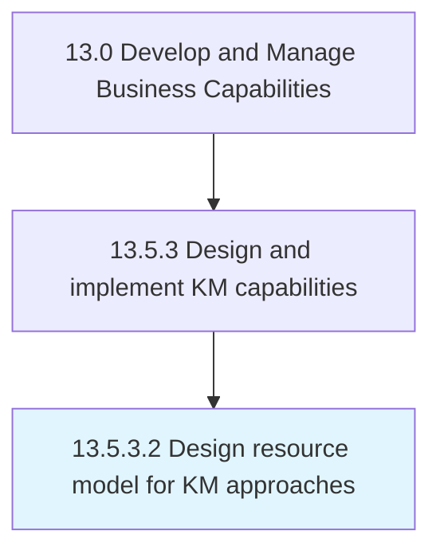

# Design resource model for KM approaches

> Creating a model to describe resources and approaches to organization's knowledge management.

## Overview

Activity 13.5.3.2 is an activity within the Develop and Manage Business Capabilities framework. 

Creating a model to describe resources and approaches to organization's knowledge management. Establish standards and guidelines to be followed.

## Process Hierarchy



## Key Statistics

| Metric | Value |
|--------|-------|
| APQC Code | 20966 |
| Hierarchy ID | 13.5.3.2 |
| Level | Activity |
| Parent | [13.5.3](../) |
| Sub-Processes | 0 |


## GraphDL Semantic Structure

```
design.ResourceModel.for.KMApproaches
```

| Component | Value | Description |
|-----------|-------|-------------|
| Verb | `design` | Primary action |
| Object | `resource model` | Direct object |
| Preposition | `for` | Relationship |
| PrepObject | `KM approaches` | Indirect object |


## Related Concepts

- ResourceModel
- KmApproaches


---

*Source: APQC PCF 20966 (13.5.3.2) - APQC*
