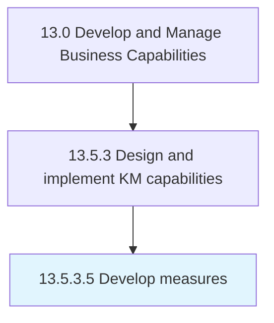

# Develop measures

> Creating metrics that can be used to systematically describe KM approaches and capabilities.

## Overview

Activity 13.5.3.5 is an activity within the Develop and Manage Business Capabilities framework. 

Creating metrics that can be used to systematically describe KM approaches and capabilities. Choose applicable scales, benchmarks and units of measure. Determine required precision and error rates.

## Process Hierarchy



## Key Statistics

| Metric | Value |
|--------|-------|
| APQC Code | 20968 |
| Hierarchy ID | 13.5.3.5 |
| Level | Activity |
| Parent | [13.5.3](../) |
| Sub-Processes | 0 |


## GraphDL Semantic Structure

```
develop.Measures
```

| Component | Value | Description |
|-----------|-------|-------------|
| Verb | `develop` | Primary action |
| Object | `measures` | Direct object |


## Related Concepts

- Measures


---

*Source: APQC PCF 20968 (13.5.3.5) - APQC*
