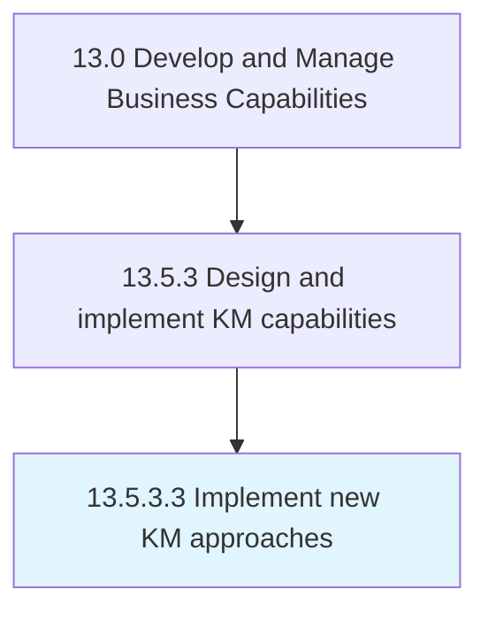

# Implement new KM approaches

> Implementing new policies, procedures, and guidelines to support knowledge management.

## Overview

Activity 13.5.3.3 is an activity within the Develop and Manage Business Capabilities framework. 

Implementing new policies, procedures, and guidelines to support knowledge management.

## Process Hierarchy



## Key Statistics

| Metric | Value |
|--------|-------|
| APQC Code | 11115 |
| Hierarchy ID | 13.5.3.3 |
| Level | Activity |
| Parent | [13.5.3](../) |
| Sub-Processes | 0 |


## GraphDL Semantic Structure

```
implement.NewKMApproaches
```

| Component | Value | Description |
|-----------|-------|-------------|
| Verb | `implement` | Primary action |
| Object | `new KM approaches` | Direct object |


## Related Concepts

- NewKmApproaches


---

*Source: APQC PCF 11115 (13.5.3.3) - APQC*
