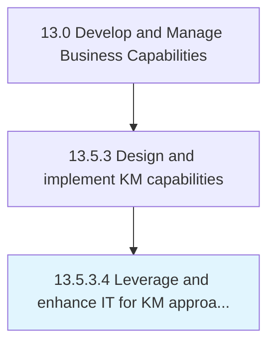

# Leverage and enhance IT for KM approaches

> Using existing technologies to improve organization's knowledge management processes.

## Overview

Activity 13.5.3.4 is an activity within the Develop and Manage Business Capabilities framework. 

Using existing technologies to improve organization's knowledge management processes. Research available third-party offerings. Develop proprietary solutions. Employ knowledge engineers, data scientists and other relevant personnel.

## Process Hierarchy



## Key Statistics

| Metric | Value |
|--------|-------|
| APQC Code | 20967 |
| Hierarchy ID | 13.5.3.4 |
| Level | Activity |
| Parent | [13.5.3](../) |
| Sub-Processes | 0 |


## GraphDL Semantic Structure

```
leverage.AndEnhanceIT.for.KMApproaches
```

| Component | Value | Description |
|-----------|-------|-------------|
| Verb | `leverage` | Primary action |
| Object | `and enhance IT` | Direct object |
| Preposition | `for` | Relationship |
| PrepObject | `KM approaches` | Indirect object |


## Related Concepts

- IT
- KmApproaches
- IT
- KmApproaches


---

*Source: APQC PCF 20967 (13.5.3.4) - APQC*
