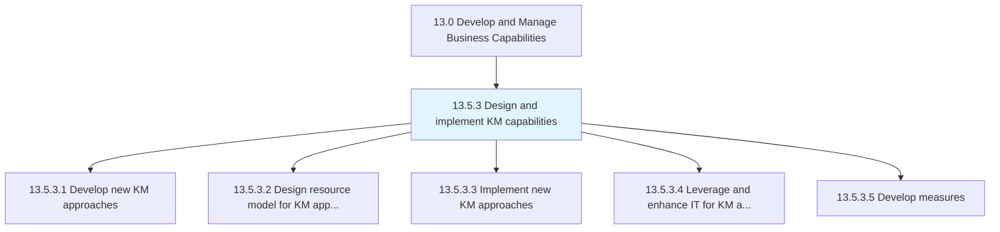
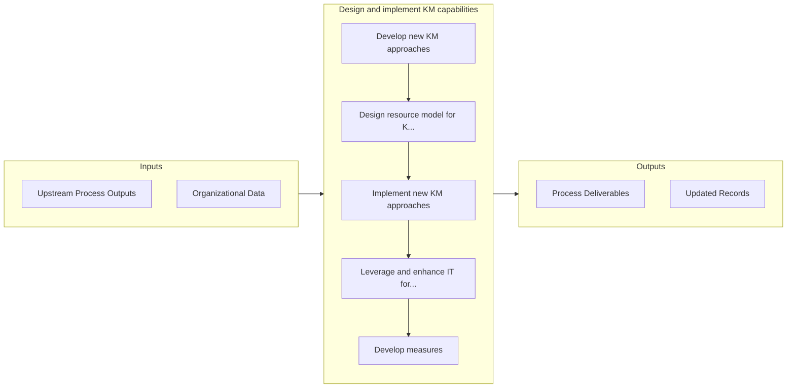

# Design and implement KM capabilities

> Creating knowledge bases and other repositories to preserve and develop company expertise, and to train new employees.

## Overview

Process 13.5.3 is a core process that defines the specific procedures for design and implement km capabilities. 

Creating knowledge bases and other repositories to preserve and develop company expertise, and to train new employees.

## Process Hierarchy



## Key Statistics

| Metric | Value |
|--------|-------|
| APQC Code | 20965 |
| Hierarchy ID | 13.5.3 |
| Level | Process |
| Parent | [13.5](../) |
| Sub-Processes | 5 |


## GraphDL Semantic Structure

```
design.AndImplementKMCapabilities
```

| Component | Value | Description |
|-----------|-------|-------------|
| Verb | `design` | Primary action |
| Object | `and implement KM capabilities` | Direct object |


## Process Flow



## Sub-Processes

| Process | Hierarchy ID | Description |
|---------|-------------|-------------|
| [Develop new KM approaches](./DevelopNewKMApproaches) | 13.5.3.1 | Designing new policies, procedures, and guidelines to support knowledge management |
| [Design resource model for KM approaches](./DesignResourceModelForKMApproaches) | 13.5.3.2 | Creating a model to describe resources and approaches to organization's knowledge management |
| [Implement new KM approaches](./ImplementNewKMApproaches) | 13.5.3.3 | Implementing new policies, procedures, and guidelines to support knowledge management |
| [Leverage and enhance IT for KM approaches](./LeverageAndEnhanceITForKMApproaches) | 13.5.3.4 | Using existing technologies to improve organization's knowledge management processes |
| [Develop measures](./DevelopMeasures) | 13.5.3.5 | Creating metrics that can be used to systematically describe KM approaches and capabilities |


## Related Concepts

- [KmCapabilities](/concepts/KmCapabilities)
- [KmCapabilities](/concepts/KmCapabilities)


---

*Source: APQC PCF 20965 (13.5.3) - APQC*
