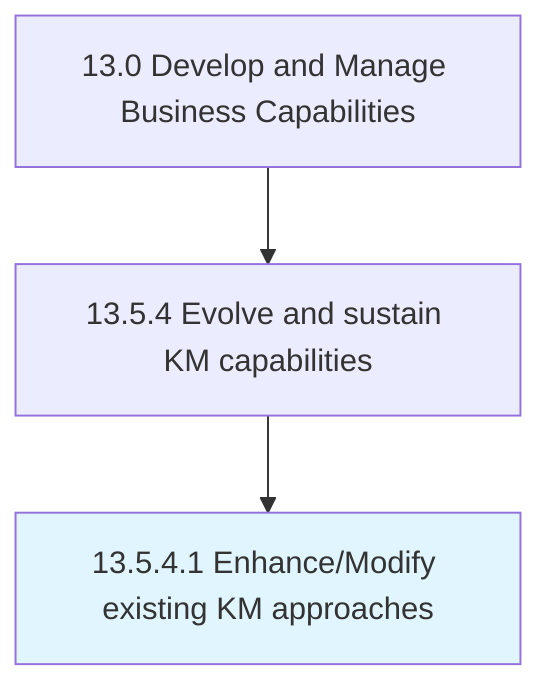

# Enhance/Modify existing KM approaches

> Leveraging KM evaluations and identified gap to enhance existing approaches.

## Overview

Activity 13.5.4.1 is an activity within the Develop and Manage Business Capabilities framework. 

Leveraging KM evaluations and identified gap to enhance existing approaches.

## Process Hierarchy



## Key Statistics

| Metric | Value |
|--------|-------|
| APQC Code | 11113 |
| Hierarchy ID | 13.5.4.1 |
| Level | Activity |
| Parent | [13.5.4](../) |
| Sub-Processes | 0 |


## GraphDL Semantic Structure

```
enhance/modify.ExistingKMApproaches
```

| Component | Value | Description |
|-----------|-------|-------------|
| Verb | `enhance/modify` | Primary action |
| Object | `existing KM approaches` | Direct object |


## Related Concepts

- ExistingKmApproaches
- ExistingKmApproaches


---

*Source: APQC PCF 11113 (13.5.4.1) - APQC*
