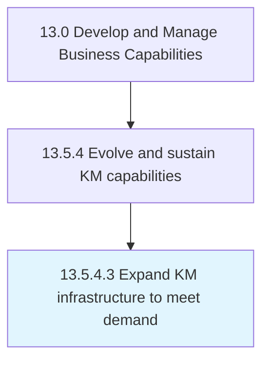

# Expand KM infrastructure to meet demand

> Augmenting available resources to better leverage the offerings of the organization to serve existing clients and to expand the client base.

## Overview

Activity 13.5.4.3 is an activity within the Develop and Manage Business Capabilities framework. 

Augmenting available resources to better leverage the offerings of the organization to serve existing clients and to expand the client base.

## Process Hierarchy



## Key Statistics

| Metric | Value |
|--------|-------|
| APQC Code | 20971 |
| Hierarchy ID | 13.5.4.3 |
| Level | Activity |
| Parent | [13.5.4](../) |
| Sub-Processes | 0 |


## GraphDL Semantic Structure

```
expand.KMInfrastructure.to.MeetDemand
```

| Component | Value | Description |
|-----------|-------|-------------|
| Verb | `expand` | Primary action |
| Object | `KM infrastructure` | Direct object |
| Preposition | `to` | Relationship |
| PrepObject | `meet demand` | Indirect object |


## Related Concepts

- [KmInfrastructure](/concepts/KmInfrastructure)
- [MeetDemand](/concepts/MeetDemand)


---

*Source: APQC PCF 20971 (13.5.4.3) - APQC*
