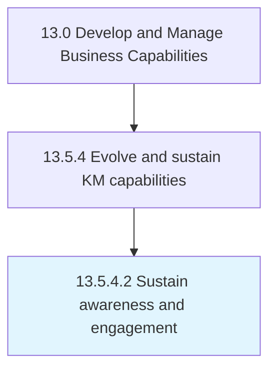

# Sustain awareness and engagement

> Developing awareness about available knowledge bases and promoting their use to maximize their impact.

## Overview

Activity 13.5.4.2 is an activity within the Develop and Manage Business Capabilities framework. 

Developing awareness about available knowledge bases and promoting their use to maximize their impact.

## Process Hierarchy



## Key Statistics

| Metric | Value |
|--------|-------|
| APQC Code | 20970 |
| Hierarchy ID | 13.5.4.2 |
| Level | Activity |
| Parent | [13.5.4](../) |
| Sub-Processes | 0 |


## GraphDL Semantic Structure

```
sustain.AwarenessAndEngagement
```

| Component | Value | Description |
|-----------|-------|-------------|
| Verb | `sustain` | Primary action |
| Object | `awareness and engagement` | Direct object |


## Related Concepts

- Awareness
- Engagement


---

*Source: APQC PCF 20970 (13.5.4.2) - APQC*
