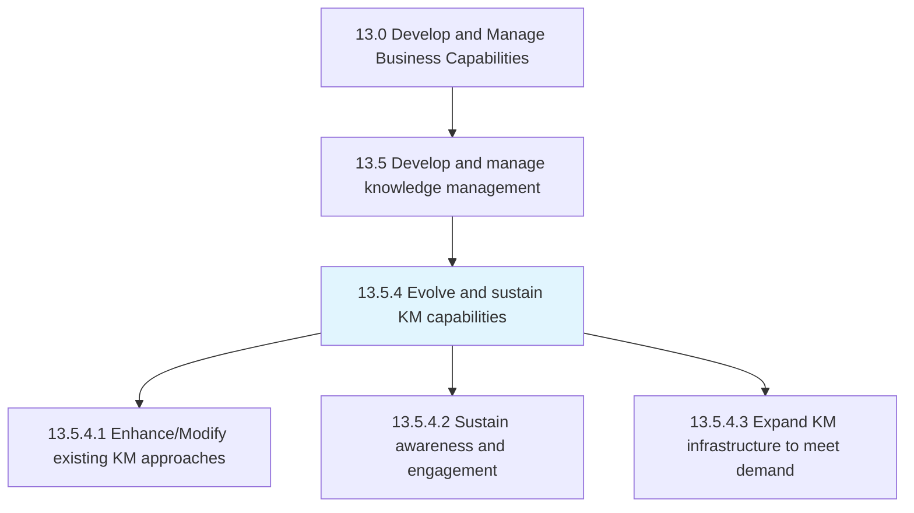
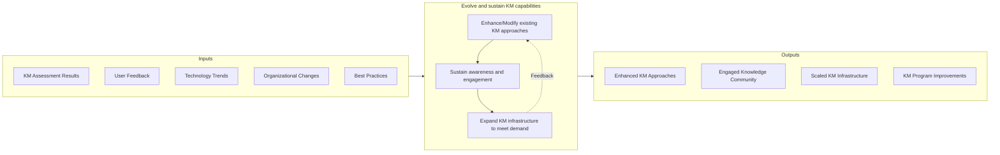

# Evolve and sustain KM capabilities

> Developing resources for improved knowledge management and knowledge engineering.

## Overview

Process 13.5.4 is a core process that defines the specific procedures for evolving and sustaining knowledge management (KM) capabilities. This process ensures that KM programs remain effective, relevant, and aligned with organizational needs over time.

Knowledge management is not a one-time implementation but an ongoing capability that must evolve as the organization changes, new technologies emerge, and workforce dynamics shift. This process addresses the continuous improvement of KM approaches, maintaining engagement and awareness, and expanding infrastructure to meet growing demands.

Effective KM capability evolution requires balancing stability (maintaining proven approaches) with innovation (adopting new methods and technologies). It also requires sustained attention to the cultural and behavioral aspects of knowledge sharing, ensuring that KM remains embedded in how work gets done rather than becoming a separate, optional activity.

## Process Hierarchy



## Key Statistics

| Metric | Value |
|--------|-------|
| APQC Code | 20969 |
| Hierarchy ID | 13.5.4 |
| Level | Process |
| Parent | [13.5](../) |
| Sub-Processes | 3 |


## GraphDL Semantic Structure

```graphdl
evolve.KMCapabilities.and.SustainKMCapabilities
```

| Component | Value | Description |
|-----------|-------|-------------|
| Verb | `evolve` | Primary action of advancing capabilities |
| Object | `KM capabilities` | Knowledge management capabilities |
| Preposition | `and` | Conjunction linking dual actions |
| PrepObject | `sustain KM capabilities` | Maintaining ongoing effectiveness |


## Process Flow



## Child Processes

### 13.5.4.1 Enhance/Modify Existing KM Approaches

Leveraging KM evaluations and identified gaps to enhance existing approaches. This activity implements improvements to KM methods, processes, and technologies based on assessment findings and evolving needs.

**Key Activities:**
- Implement improvements based on gap analysis
- Update KM processes and procedures
- Enhance KM technology capabilities
- Incorporate emerging best practices
- Sunset ineffective approaches

[View Process Details](./EnhanceModifyExistingKMApproaches)

### 13.5.4.2 Sustain Awareness and Engagement

Developing awareness about available knowledge bases and promoting their use to maximize their impact. This activity maintains ongoing attention to KM through communication, training, and recognition programs.

**Key Activities:**
- Conduct ongoing KM awareness campaigns
- Recognize and reward knowledge sharing behaviors
- Build and nurture communities of practice
- Promote KM success stories and benefits
- Provide ongoing KM training and support

[View Process Details](./SustainAwarenessAndEngagement)

### 13.5.4.3 Expand KM Infrastructure to Meet Demand

Augmenting available resources to better leverage the offerings of the organization to serve existing and potential knowledge needs. This activity scales KM systems and capabilities as usage grows and needs expand.

**Key Activities:**
- Scale KM technology infrastructure
- Expand knowledge repository capacity
- Enhance search and discovery capabilities
- Extend KM to new domains and use cases
- Integrate KM with emerging technologies (AI, etc.)

[View Process Details](./ExpandKMInfrastructureToMeetDemand)


## RACI Matrix

| Activity | Responsible | Accountable | Consulted | Informed |
|----------|-------------|-------------|-----------|----------|
| Enhance KM approaches | KM Team | KM Director | Users, IT | Executive team |
| Update KM processes | KM Analyst | KM Manager | Process owners | Stakeholders |
| Conduct awareness campaigns | Communications | KM Manager | HR, Marketing | All employees |
| Recognize knowledge contributors | KM Manager | HR Director | Department Heads | All employees |
| Nurture communities of practice | Community Managers | KM Director | SMEs | Participants |
| Scale KM infrastructure | IT Team | CIO | KM Team | Users |
| Integrate emerging technologies | IT Team | CTO | KM Team | Innovation team |


## Metrics and KPIs

| Metric | Description | Target |
|--------|-------------|--------|
| KM Improvement Implementation | Percentage of planned improvements completed | >80% |
| KM Awareness Score | Employee awareness of KM resources | >85% |
| Knowledge Sharing Participation | Active contributors to knowledge bases | >30% |
| Community of Practice Activity | Engagement in communities | Increasing trend |
| System Availability | KM platform uptime | >99.5% |
| Search Success Rate | Users finding needed knowledge | >90% |
| Technology Currency | Systems on current versions | >95% |
| User Satisfaction | Satisfaction with KM capabilities | >4.0/5.0 |


## Related Departments

- [Knowledge Management](/departments/KM) - KM program leadership
- [Information Technology](/departments/IT) - Infrastructure and technology
- [Human Resources](/departments/HR) - Recognition and culture
- [Communications](/departments/Communications) - Awareness campaigns
- [Training](/departments/Training) - KM training programs


## Related Occupations

- [Management Analysts](/occupations/Business/ManagementAnalysts) - KM improvement consulting
- [Training and Development Specialists](/occupations/HR/TrainingSpecialists) - KM training
- [Computer and Information Systems Managers](/occupations/Technology/ITManagers) - Technology infrastructure
- [Technical Writers](/occupations/Communications/TechnicalWriters) - Knowledge content development
- [Community Managers](/occupations/Communications/CommunityManagers) - Community engagement


## Industry Variations

### Technology

Technology companies focus on developer knowledge sharing, API documentation, and integration with development tools. AI-powered knowledge assistance and automated knowledge capture are emerging priorities.

### Professional Services

Professional services emphasize expertise development, project learning capture, and client knowledge management. Communities of practice centered on service lines are common.

### Healthcare

Healthcare KM evolution addresses clinical decision support, medical literature integration, and care protocol updates. Compliance with clinical knowledge standards is essential.


## KM Evolution Approaches

- **Continuous Improvement** - Incremental enhancements based on feedback
- **Technology Refresh** - Periodic platform updates and migrations
- **Capability Extension** - Adding new KM domains and use cases
- **AI Integration** - Leveraging machine learning for knowledge discovery
- **Cultural Reinforcement** - Ongoing attention to sharing behaviors


## Emerging KM Trends

- **AI-Powered Knowledge Discovery** - Machine learning for content recommendation
- **Conversational Knowledge Access** - Chatbots and virtual assistants
- **Video Knowledge Capture** - Rich media for tacit knowledge
- **Graph-Based Knowledge** - Connected knowledge networks
- **Real-Time Knowledge Flow** - Integration with work processes


---

*Source: APQC PCF 20969 (13.5.4) - APQC*
