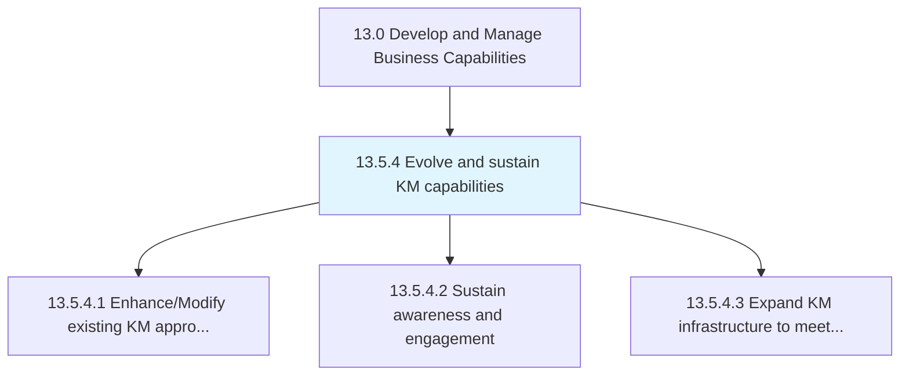
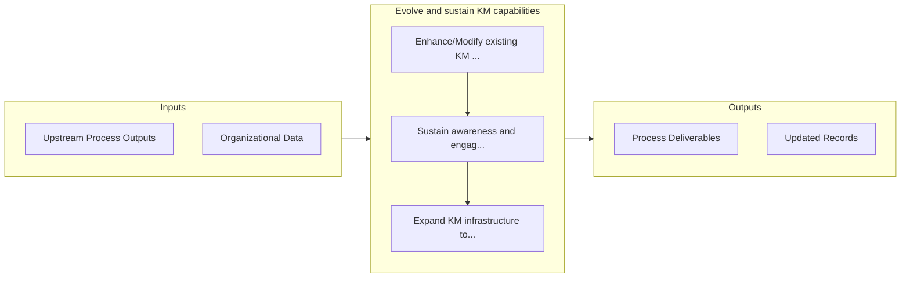

# Evolve and sustain KM capabilities

> Developing resources for improved knowledge management and knowledge engineering.

## Overview

Process 13.5.4 is a core process that defines the specific procedures for evolve and sustain km capabilities. 

Developing resources for improved knowledge management and knowledge engineering.

## Process Hierarchy



## Key Statistics

| Metric | Value |
|--------|-------|
| APQC Code | 20969 |
| Hierarchy ID | 13.5.4 |
| Level | Process |
| Parent | [13.5](../) |
| Sub-Processes | 3 |


## GraphDL Semantic Structure

```
evolve.AndSustainKMCapabilities
```

| Component | Value | Description |
|-----------|-------|-------------|
| Verb | `evolve` | Primary action |
| Object | `and sustain KM capabilities` | Direct object |


## Process Flow



## Sub-Processes

| Process | Hierarchy ID | Description |
|---------|-------------|-------------|
| [Enhance/Modify existing KM approaches](./EnhanceModifyExistingKMApproaches) | 13.5.4.1 | Leveraging KM evaluations and identified gap to enhance existing approaches |
| [Sustain awareness and engagement](./SustainAwarenessAndEngagement) | 13.5.4.2 | Developing awareness about available knowledge bases and promoting their use to maximize their impac |
| [Expand KM infrastructure to meet demand](./ExpandKMInfrastructureToMeetDemand) | 13.5.4.3 | Augmenting available resources to better leverage the offerings of the organization to serve existin |


## Related Concepts

- KmCapabilities
- KmCapabilities


---

*Source: APQC PCF 20969 (13.5.4) - APQC*
