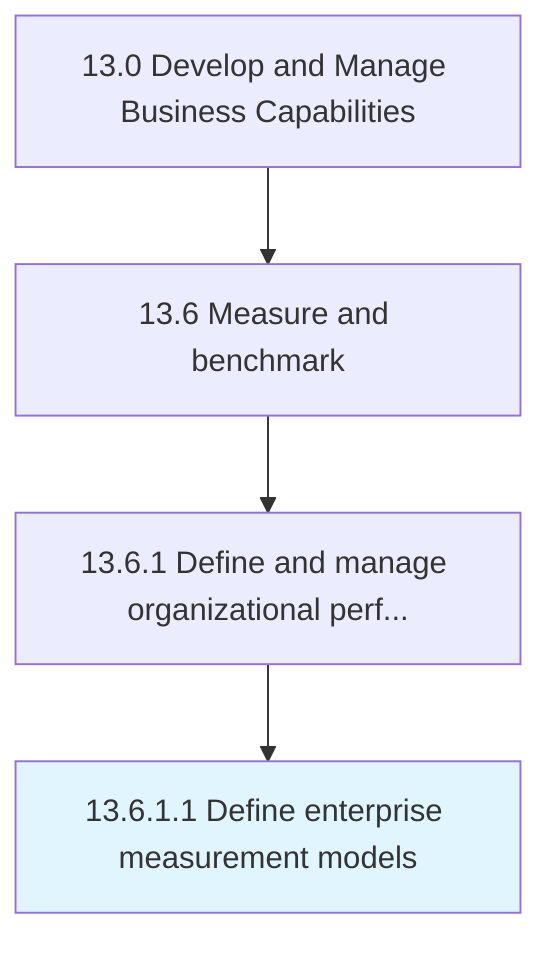

# Define enterprise measurement models

> Developing a model for organization's management systems.

## Overview

Activity 13.6.1.1 is an activity within the Develop and Manage Business Capabilities framework. 

Developing a model for organization's management systems. Develop a high-level measurement system to track performance across the enterprise or in specific functions or business units. Determine which processes to measure, which measures to use, how often to measure, and measurement targets. Review strategic decisions about how to best measure an organization.

## Process Hierarchy



## Key Statistics

| Metric | Value |
|--------|-------|
| APQC Code | 11075 |
| Hierarchy ID | 13.6.1.1 |
| Level | Activity |
| Parent | [13.6.1](../) |
| Sub-Processes | 0 |


## GraphDL Semantic Structure

```
define.EnterpriseMeasurementModels
```

| Component | Value | Description |
|-----------|-------|-------------|
| Verb | `define` | Primary action |
| Object | `enterprise measurement models` | Direct object |


## Related Concepts

- [EnterpriseMeasurementModels](/concepts/EnterpriseMeasurementModels)


---

*Source: APQC PCF 11075 (13.6.1.1) - APQC*
