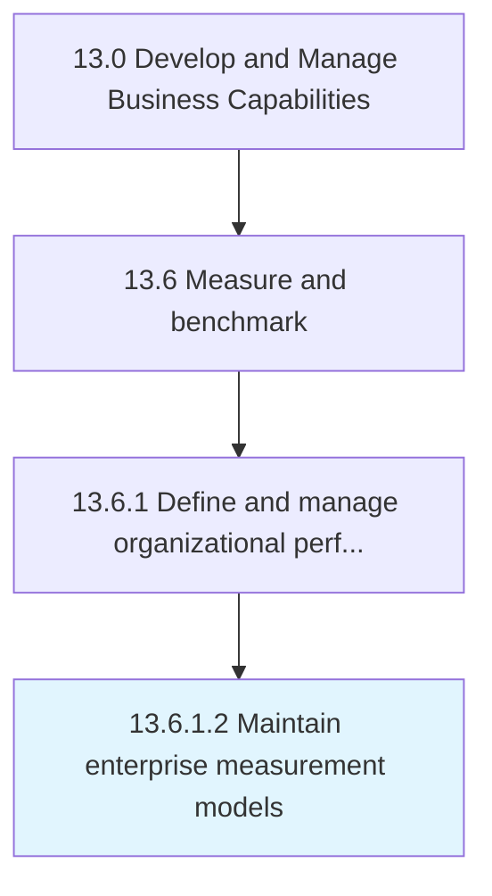

# Maintain enterprise measurement models

> Reviewing, evaluating, and updating enterprise measurement models.

## Overview

Activity 13.6.1.2 is an activity within the Develop and Manage Business Capabilities framework. 

Reviewing, evaluating, and updating enterprise measurement models. Align measurement models to current and future goals and performance targets, and make adjustments to support visibility and reporting needs across the organization.

## Process Hierarchy



## Key Statistics

| Metric | Value |
|--------|-------|
| APQC Code | 21586 |
| Hierarchy ID | 13.6.1.2 |
| Level | Activity |
| Parent | [13.6.1](../) |
| Sub-Processes | 0 |


## GraphDL Semantic Structure

```
maintain.EnterpriseMeasurementModels
```

| Component | Value | Description |
|-----------|-------|-------------|
| Verb | `maintain` | Primary action |
| Object | `enterprise measurement models` | Direct object |


## Related Concepts

- [EnterpriseMeasurementModels](/concepts/EnterpriseMeasurementModels)


---

*Source: APQC PCF 21586 (13.6.1.2) - APQC*
