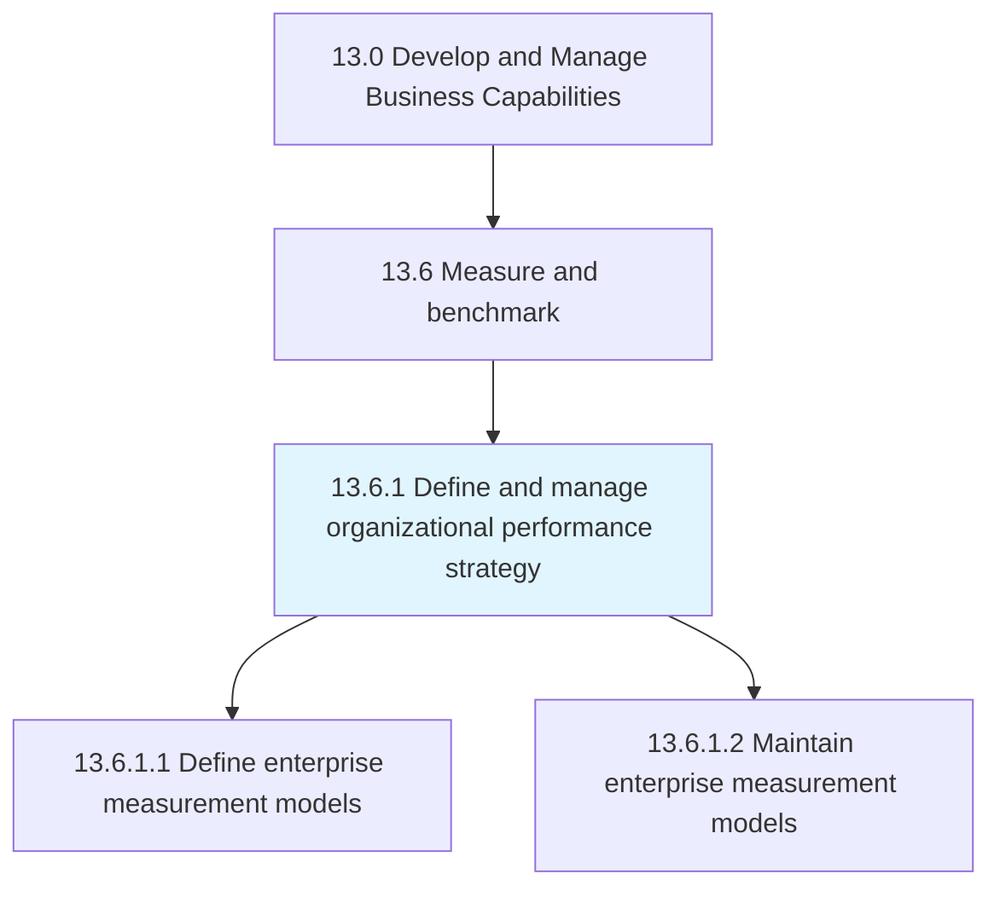
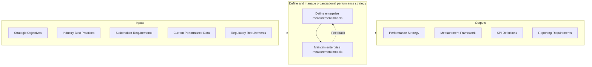

# Define and manage organizational performance strategy

> Creating and implementing a strategy for managing organizational performance.

## Overview

Process 13.6.1 is a core process that defines the specific procedures for establishing and managing an organizational performance strategy. This process creates the strategic framework for measuring, tracking, and improving performance across the enterprise.

The organizational performance strategy defines what will be measured, how measurements will be taken, and how performance data will be used to drive decisions and improvements. It encompasses a blueprint for tactical measurement of internal processes and workforce improvement, aligned with broader enterprise metrics and employee performance systems.

An effective performance strategy balances multiple perspectives - financial, customer, process, and learning - to provide a holistic view of organizational health. It connects strategic objectives to operational metrics, creating line-of-sight from individual activities to enterprise outcomes.

## Process Hierarchy



## Key Statistics

| Metric | Value |
|--------|-------|
| APQC Code | 21585 |
| Hierarchy ID | 13.6.1 |
| Level | Process |
| Parent | [13.6](../) |
| Sub-Processes | 2 |


## GraphDL Semantic Structure

```graphdl
define.OrganizationalPerformanceStrategy.and.ManageOrganizationalPerformanceStrategy
```

| Component | Value | Description |
|-----------|-------|-------------|
| Verb | `define` | Primary action of establishing strategy |
| Object | `organizational performance strategy` | Performance management framework |
| Preposition | `and` | Conjunction linking dual actions |
| PrepObject | `manage organizational performance strategy` | Ongoing governance |


## Process Flow



## Child Processes

### 13.6.1.1 Define Enterprise Measurement Models

Developing a model for organization's management systems. This activity establishes the frameworks, metrics, and measurement approaches that will be used across the enterprise.

**Key Activities:**
- Define measurement philosophy and principles
- Select or develop performance framework (Balanced Scorecard, OKRs, etc.)
- Establish KPI hierarchy from strategic to operational
- Define data collection and analysis methods
- Align metrics with strategic objectives

[View Process Details](./DefineEnterpriseMeasurementModels)

### 13.6.1.2 Maintain Enterprise Measurement Models

Reviewing, evaluating, and updating enterprise measurement models. This activity ensures that performance measurement remains relevant and effective as the organization evolves.

**Key Activities:**
- Review metric effectiveness and relevance
- Update KPIs based on strategic changes
- Refine data collection and analysis methods
- Address measurement gaps and issues
- Align with emerging best practices

[View Process Details](./MaintainEnterpriseMeasurementModels)


## RACI Matrix

| Activity | Responsible | Accountable | Consulted | Informed |
|----------|-------------|-------------|-----------|----------|
| Define performance philosophy | Strategy Team | Chief Strategy Officer | Executive team | All managers |
| Select measurement framework | Performance Manager | COO | Department Heads | Stakeholders |
| Establish KPI hierarchy | Business Analysts | Performance Manager | Process Owners | Teams |
| Define data collection methods | Data Analysts | Performance Manager | IT | Operations |
| Review metric effectiveness | Performance Analyst | Performance Manager | Users | Management |
| Update measurement models | Performance Team | COO | Strategy | All stakeholders |
| Align with strategic changes | Strategy Team | Chief Strategy Officer | Performance Team | Executive team |


## Metrics and KPIs

| Metric | Description | Target |
|--------|-------------|--------|
| KPI Coverage | Strategic objectives with defined KPIs | 100% |
| Metric Alignment | KPIs linked to strategic themes | >95% |
| Data Availability | Required data available for measurement | >98% |
| Measurement Timeliness | Performance data delivered on schedule | 100% |
| Metric Review Cycle | KPIs reviewed within update cycle | 100% annual |
| User Adoption | Managers actively using performance data | >90% |
| Framework Effectiveness | User satisfaction with measurement framework | >4.0/5.0 |
| Actionability | Metrics leading to improvement actions | >75% |


## Related Departments

- [Executive Office](/departments/Executive) - Strategic direction and performance accountability
- [Strategy & Planning](/departments/Strategy) - Strategic alignment
- [Finance](/departments/Finance) - Financial metrics and reporting
- [Information Technology](/departments/IT) - Data systems and analytics
- [Human Resources](/departments/HR) - Employee performance alignment


## Related Occupations

- [Management Analysts](/occupations/Business/ManagementAnalysts) - Performance strategy development
- [Business Intelligence Analysts](/occupations/Business/BIAnalysts) - Analytics and reporting
- [Financial Analysts](/occupations/Finance/FinancialAnalysts) - Financial performance metrics
- [Operations Research Analysts](/occupations/Business/OperationsResearch) - Performance modeling
- [Data Scientists](/occupations/Technology/DataScientists) - Advanced analytics


## Industry Variations

### Manufacturing

Manufacturing performance strategy emphasizes operational metrics like OEE, cycle time, and quality rates. Real-time dashboards and shop floor visibility are common. Performance measurement often integrates with MES systems.

### Financial Services

Financial services focus on risk-adjusted returns, efficiency ratios, and customer metrics. Regulatory metrics are mandatory. Real-time trading and operational dashboards are common in certain business lines.

### Healthcare

Healthcare performance strategy addresses clinical outcomes, patient experience, and financial sustainability. Value-based care metrics are increasingly important. Quality reporting for regulatory compliance is required.


## Performance Frameworks

Organizations commonly adopt established frameworks:

- **Balanced Scorecard** - Four perspectives: Financial, Customer, Process, Learning
- **OKRs (Objectives and Key Results)** - Quarterly goal-setting framework
- **EFQM Excellence Model** - European quality and performance framework
- **Baldrige Performance Excellence** - Comprehensive excellence framework
- **Lean Metrics** - Flow, waste, and value metrics


## Performance Hierarchy

Effective performance measurement creates cascading alignment:

- **Strategic** - Enterprise-level outcomes and objectives
- **Tactical** - Department and function performance
- **Operational** - Process and activity metrics
- **Individual** - Employee performance measures


---

*Source: APQC PCF 21585 (13.6.1) - APQC*
