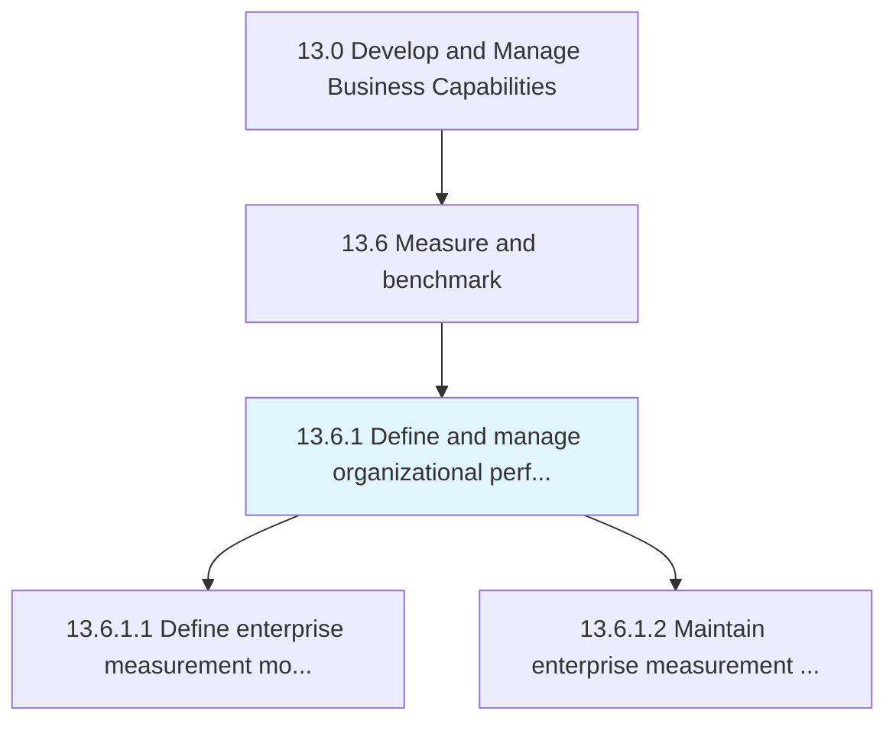
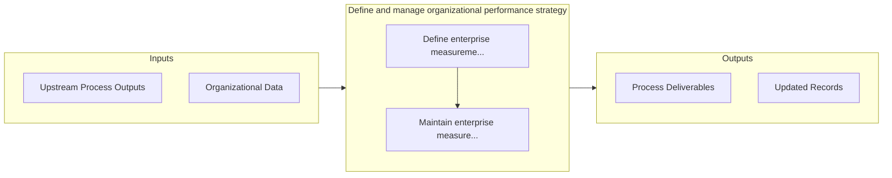

# Define and manage organizational performance strategy

> Creating and implementing a strategy for managing organizational performance.

## Overview

Process 13.6.1 is a core process that defines the specific procedures for define and manage organizational performance strategy. 

Creating and implementing a strategy for managing organizational performance. The strategy should include approaches for measuring, tracking, streamlining, and improving internal performance. It encompasses a blueprint for the tactical measurement of internal processes and work force improvement, in alignment with Employee Metrics Developed and Managed [10526].

## Process Hierarchy



## Key Statistics

| Metric | Value |
|--------|-------|
| APQC Code | 21585 |
| Hierarchy ID | 13.6.1 |
| Level | Process |
| Parent | [13.6](../) |
| Sub-Processes | 2 |


## GraphDL Semantic Structure

```graphdl
define.AndManageOrganizationalPerformanceStrategy
```

| Component | Value | Description |
|-----------|-------|-------------|
| Verb | `define` | Primary action |
| Object | `and manage organizational performance strategy` | Direct object |


## Process Flow



## Sub-Processes

| Process | Hierarchy ID | Description |
|---------|-------------|-------------|
| [Define enterprise measurement models](./DefineEnterpriseMeasurementModels) | 13.6.1.1 | Developing a model for organization's management systems |
| [Maintain enterprise measurement models](./MaintainEnterpriseMeasurementModels) | 13.6.1.2 | Reviewing, evaluating, and updating enterprise measurement models |


## Related Concepts

- OrganizationalPerformanceStrategy
- OrganizationalPerformanceStrategy


---

*Source: APQC PCF 21585 (13.6.1) - APQC*
