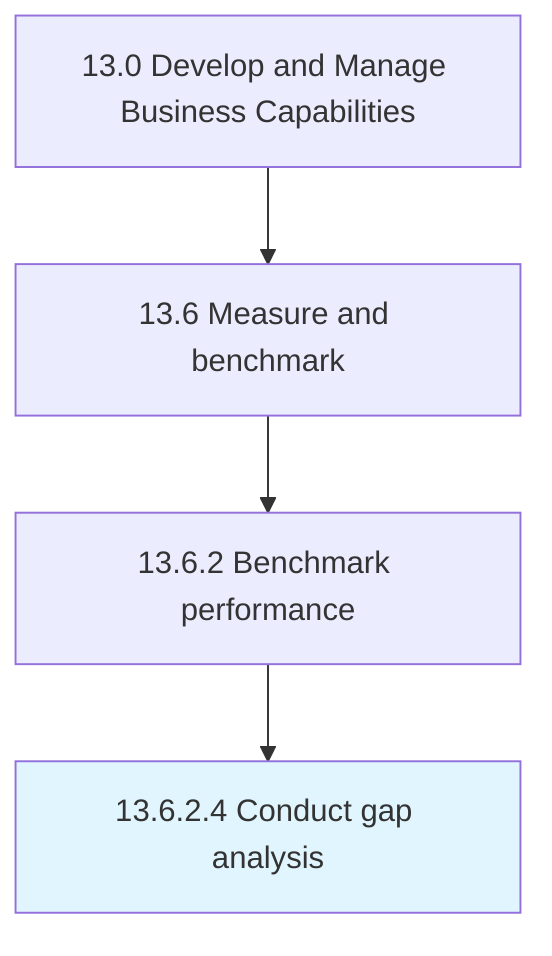

# Conduct gap analysis

> Examining performance against benchmarked organizations or entities.

## Overview

Activity 13.6.2.4 is an activity within the Develop and Manage Business Capabilities framework. 

Examining performance against benchmarked organizations or entities. Determine how much performance needs to change to meet expectations. Reach strategic goals.

## Process Hierarchy



## Key Statistics

| Metric | Value |
|--------|-------|
| APQC Code | 11087 |
| Hierarchy ID | 13.6.2.4 |
| Level | Activity |
| Parent | [13.6.2](../) |
| Sub-Processes | 0 |


## GraphDL Semantic Structure

```
conduct.GapAnalysis
```

| Component | Value | Description |
|-----------|-------|-------------|
| Verb | `conduct` | Primary action |
| Object | `gap analysis` | Direct object |


## Related Concepts

- [GapAnalysis](/concepts/GapAnalysis)


---

*Source: APQC PCF 11087 (13.6.2.4) - APQC*
