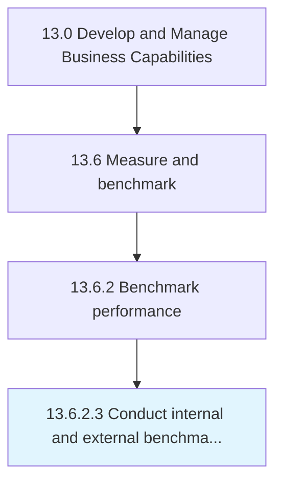

# Conduct internal and external benchmarking

> Benchmarking internal processes and against external competitors.

## Overview

Activity 13.6.2.3 is an activity within the Develop and Manage Business Capabilities framework. 

Benchmarking internal processes and against external competitors.

## Process Hierarchy



## Key Statistics

| Metric | Value |
|--------|-------|
| APQC Code | 11085 |
| Hierarchy ID | 13.6.2.3 |
| Level | Activity |
| Parent | [13.6.2](../) |
| Sub-Processes | 0 |


## GraphDL Semantic Structure

```
conduct.InternalAndExternalBenchmarking
```

| Component | Value | Description |
|-----------|-------|-------------|
| Verb | `conduct` | Primary action |
| Object | `internal and external benchmarking` | Direct object |


## Related Concepts

- [Internal](/concepts/Internal)
- [ExternalBenchmarking](/concepts/ExternalBenchmarking)


---

*Source: APQC PCF 11085 (13.6.2.3) - APQC*
