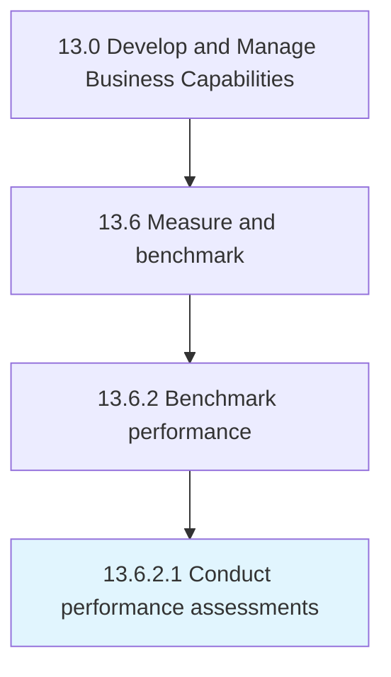

# Conduct performance assessments

> Measuring, researching, and recording the performance of people, processes, mechanisms, or other areas of the business that the organization wants to benchmark or track.

## Overview

Activity 13.6.2.1 is an activity within the Develop and Manage Business Capabilities framework. 

Measuring, researching, and recording the performance of people, processes, mechanisms, or other areas of the business that the organization wants to benchmark or track.

## Process Hierarchy



## Key Statistics

| Metric | Value |
|--------|-------|
| APQC Code | 11083 |
| Hierarchy ID | 13.6.2.1 |
| Level | Activity |
| Parent | [13.6.2](../) |
| Sub-Processes | 0 |


## GraphDL Semantic Structure

```
conduct.PerformanceAssessments
```

| Component | Value | Description |
|-----------|-------|-------------|
| Verb | `conduct` | Primary action |
| Object | `performance assessments` | Direct object |


## Related Concepts

- [PerformanceAssessments](/concepts/PerformanceAssessments)


---

*Source: APQC PCF 11083 (13.6.2.1) - APQC*
