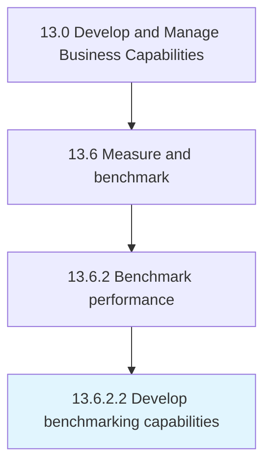

# Develop benchmarking capabilities

> Improving an organization's ability to compare its performance internally or externally, and maintaining benchmarking relationships with other organizations.

## Overview

Activity 13.6.2.2 is an activity within the Develop and Manage Business Capabilities framework. 

Improving an organization's ability to compare its performance internally or externally, and maintaining benchmarking relationships with other organizations. Train staff in benchmarking. Develop technological solutions or other materials to aid benchmarking efforts. Consult with external entities to gain knowledge or tools to help benchmark.

## Process Hierarchy



## Key Statistics

| Metric | Value |
|--------|-------|
| APQC Code | 11084 |
| Hierarchy ID | 13.6.2.2 |
| Level | Activity |
| Parent | [13.6.2](../) |
| Sub-Processes | 0 |


## GraphDL Semantic Structure

```
develop.BenchmarkingCapabilities
```

| Component | Value | Description |
|-----------|-------|-------------|
| Verb | `develop` | Primary action |
| Object | `benchmarking capabilities` | Direct object |


## Related Concepts

- BenchmarkingCapabilities


---

*Source: APQC PCF 11084 (13.6.2.2) - APQC*
