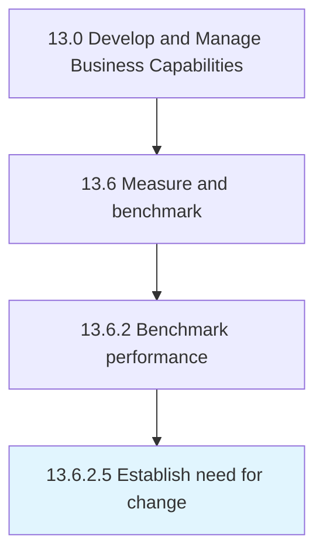

# Establish need for change

> Establishing a need for changing the performance of the organization.

## Overview

Activity 13.6.2.5 is an activity within the Develop and Manage Business Capabilities framework. 

Establishing a need for changing the performance of the organization. Make use of the gap analysis results in order to define the need for change.

## Process Hierarchy



## Key Statistics

| Metric | Value |
|--------|-------|
| APQC Code | 11088 |
| Hierarchy ID | 13.6.2.5 |
| Level | Activity |
| Parent | [13.6.2](../) |
| Sub-Processes | 0 |


## GraphDL Semantic Structure

```
establish.Need.for.Change
```

| Component | Value | Description |
|-----------|-------|-------------|
| Verb | `establish` | Primary action |
| Object | `need` | Direct object |
| Preposition | `for` | Relationship |
| PrepObject | `change` | Indirect object |


## Related Concepts

- Need
- Change


---

*Source: APQC PCF 11088 (13.6.2.5) - APQC*
