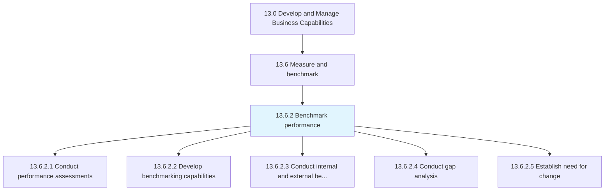
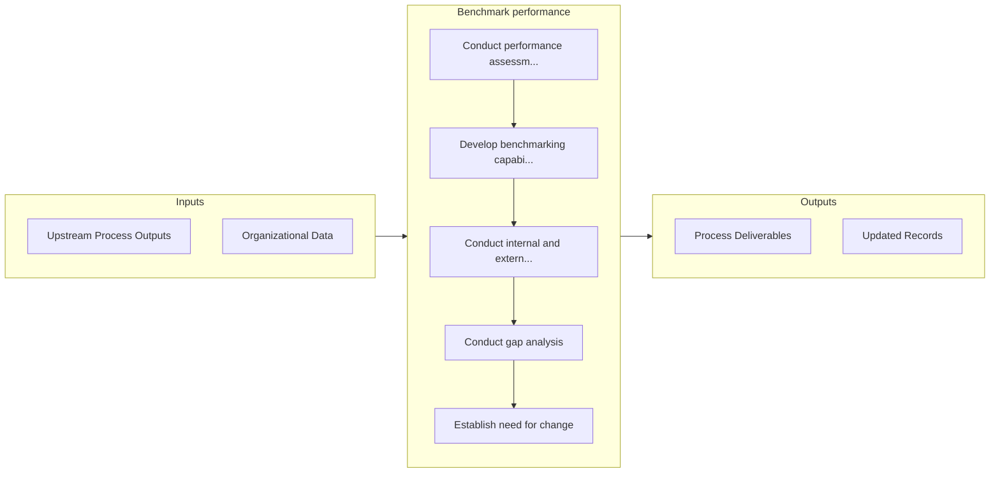

# Benchmark performance

> Comparing organizational performance internally or externally with other organizations.

## Overview

Process 13.6.2 is a core process that defines the specific procedures for benchmark performance. 

Comparing organizational performance internally or externally with other organizations.

## Process Hierarchy



## Key Statistics

| Metric | Value |
|--------|-------|
| APQC Code | 11072 |
| Hierarchy ID | 13.6.2 |
| Level | Process |
| Parent | [13.6](../) |
| Sub-Processes | 5 |


## GraphDL Semantic Structure

```
benchmark.Performance
```

| Component | Value | Description |
|-----------|-------|-------------|
| Verb | `benchmark` | Primary action |
| Object | `performance` | Direct object |


## Process Flow



## Sub-Processes

| Process | Hierarchy ID | Description |
|---------|-------------|-------------|
| [Conduct performance assessments](./ConductPerformanceAssessments) | 13.6.2.1 | Measuring, researching, and recording the performance of people, processes, mechanisms, or other are |
| [Develop benchmarking capabilities](./DevelopBenchmarkingCapabilities) | 13.6.2.2 | Improving an organization's ability to compare its performance internally or externally, and maintai |
| [Conduct internal and external benchmarking](./ConductInternalAndExternalBenchmarking) | 13.6.2.3 | Benchmarking internal processes and against external competitors |
| [Conduct gap analysis](./ConductGapAnalysis) | 13.6.2.4 | Examining performance against benchmarked organizations or entities |
| [Establish need for change](./EstablishNeedForChange) | 13.6.2.5 | Establishing a need for changing the performance of the organization |


## Related Concepts

- [Performance](/concepts/Performance)


---

*Source: APQC PCF 11072 (13.6.2) - APQC*
