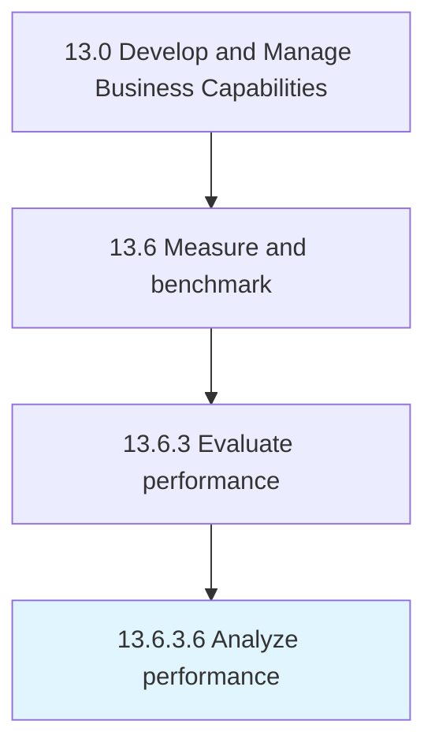

# Analyze performance

> Evaluating the gaps between achieved and benchmarked performance.

## Overview

Activity 13.6.3.6 is an activity within the Develop and Manage Business Capabilities framework. 

Evaluating the gaps between achieved and benchmarked performance. Analyze how performance differs from the optimal or expected performance.

## Process Hierarchy



## Key Statistics

| Metric | Value |
|--------|-------|
| APQC Code | 10274 |
| Hierarchy ID | 13.6.3.6 |
| Level | Activity |
| Parent | [13.6.3](../) |
| Sub-Processes | 0 |


## GraphDL Semantic Structure

```
analyze.Performance
```

| Component | Value | Description |
|-----------|-------|-------------|
| Verb | `analyze` | Primary action |
| Object | `performance` | Direct object |


## Related Concepts

- [Performance](/concepts/Performance)


---

*Source: APQC PCF 10274 (13.6.3.6) - APQC*
