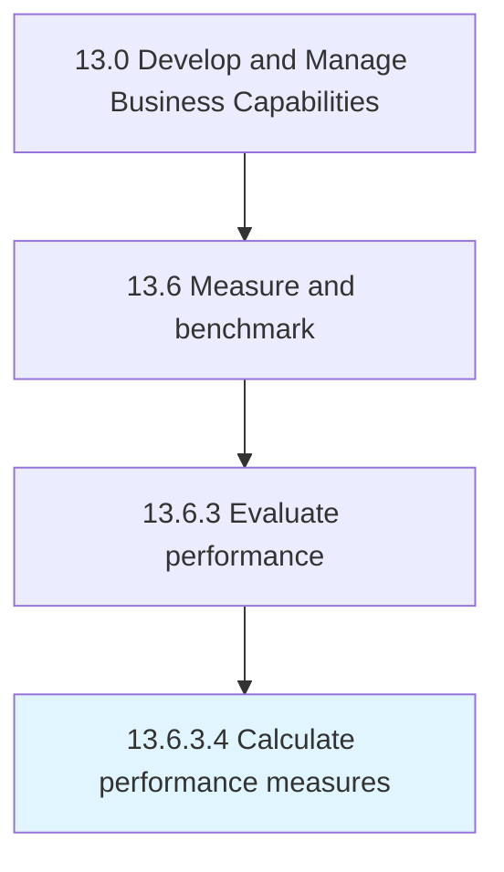

# Calculate performance measures

> Measuring the performance of process planning.

## Overview

Activity 13.6.3.4 is an activity within the Develop and Manage Business Capabilities framework. 

Measuring the performance of process planning. Quantify the performance, record results of the performance tests, and report them to the appropriate authority.

## Process Hierarchy



## Key Statistics

| Metric | Value |
|--------|-------|
| APQC Code | 10272 |
| Hierarchy ID | 13.6.3.4 |
| Level | Activity |
| Parent | [13.6.3](../) |
| Sub-Processes | 0 |


## GraphDL Semantic Structure

```
calculate.PerformanceMeasures
```

| Component | Value | Description |
|-----------|-------|-------------|
| Verb | `calculate` | Primary action |
| Object | `performance measures` | Direct object |


## Related Concepts

- [PerformanceMeasures](/concepts/PerformanceMeasures)


---

*Source: APQC PCF 10272 (13.6.3.4) - APQC*
