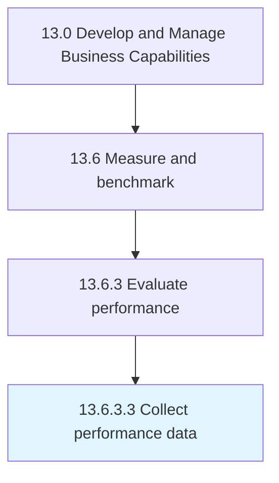

# Collect performance data

> Consolidating acquired metrics and trends.

## Overview

Activity 13.6.3.3 is an activity within the Develop and Manage Business Capabilities framework. 

Consolidating acquired metrics and trends. Provide data that can be benchmarked against historical data.

## Process Hierarchy



## Key Statistics

| Metric | Value |
|--------|-------|
| APQC Code | 20148 |
| Hierarchy ID | 13.6.3.3 |
| Level | Activity |
| Parent | [13.6.3](../) |
| Sub-Processes | 0 |


## GraphDL Semantic Structure

```
collect.PerformanceData
```

| Component | Value | Description |
|-----------|-------|-------------|
| Verb | `collect` | Primary action |
| Object | `performance data` | Direct object |


## Related Concepts

- PerformanceData


---

*Source: APQC PCF 20148 (13.6.3.3) - APQC*
