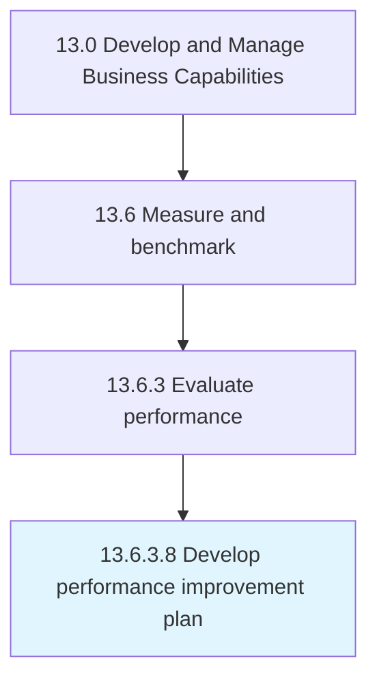

# Develop performance improvement plan

> Using performance indicators to report, analyze, and create a detailed performance improvement plan to bridge the performance gaps.

## Overview

Activity 13.6.3.8 is an activity within the Develop and Manage Business Capabilities framework. 

Using performance indicators to report, analyze, and create a detailed performance improvement plan to bridge the performance gaps.

## Process Hierarchy



## Key Statistics

| Metric | Value |
|--------|-------|
| APQC Code | 10276 |
| Hierarchy ID | 13.6.3.8 |
| Level | Activity |
| Parent | [13.6.3](../) |
| Sub-Processes | 0 |


## GraphDL Semantic Structure

```
develop.PerformanceImprovementPlan
```

| Component | Value | Description |
|-----------|-------|-------------|
| Verb | `develop` | Primary action |
| Object | `performance improvement plan` | Direct object |


## Related Concepts

- PerformanceImprovementPlan


---

*Source: APQC PCF 10276 (13.6.3.8) - APQC*
