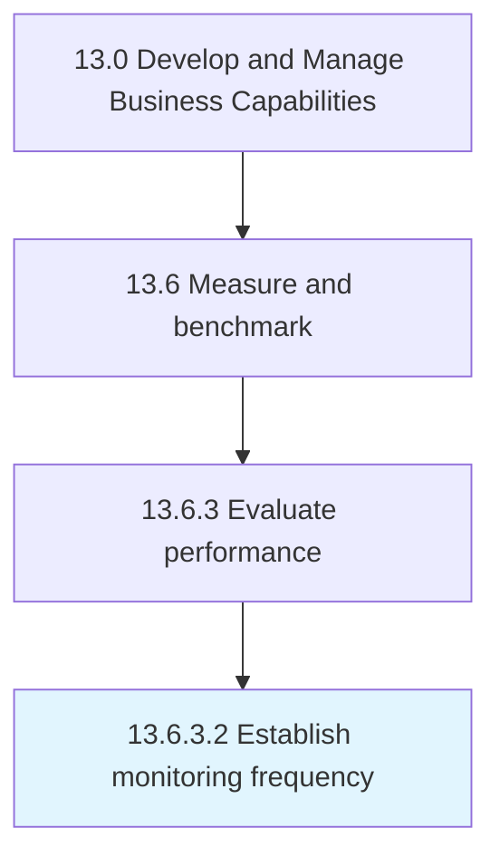

# Establish monitoring frequency

> Deciding on the appropriate amount of supervisions that are needed to effectively assess the performance of business plans.

## Overview

Activity 13.6.3.2 is an activity within the Develop and Manage Business Capabilities framework. 

Deciding on the appropriate amount of supervisions that are needed to effectively assess the performance of business plans.

## Process Hierarchy



## Key Statistics

| Metric | Value |
|--------|-------|
| APQC Code | 10271 |
| Hierarchy ID | 13.6.3.2 |
| Level | Activity |
| Parent | [13.6.3](../) |
| Sub-Processes | 0 |


## GraphDL Semantic Structure

```
establish.MonitoringFrequency
```

| Component | Value | Description |
|-----------|-------|-------------|
| Verb | `establish` | Primary action |
| Object | `monitoring frequency` | Direct object |


## Related Concepts

- MonitoringFrequency


---

*Source: APQC PCF 10271 (13.6.3.2) - APQC*
