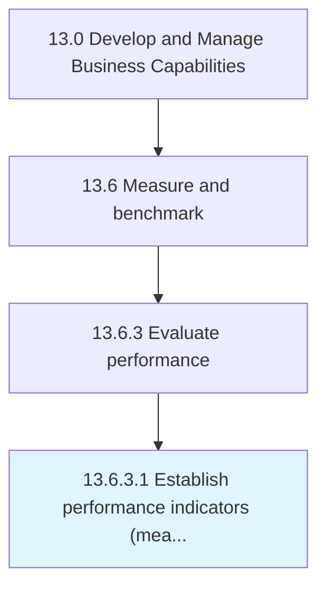

# Establish performance indicators (measures)

> Designing key measures that analyze and interpret how effectively the business is achieving its objectives.

## Overview

Activity 13.6.3.1 is an activity within the Develop and Manage Business Capabilities framework. 

Designing key measures that analyze and interpret how effectively the business is achieving its objectives.

## Process Hierarchy



## Key Statistics

| Metric | Value |
|--------|-------|
| APQC Code | 10270 |
| Hierarchy ID | 13.6.3.1 |
| Level | Activity |
| Parent | [13.6.3](../) |
| Sub-Processes | 0 |


## GraphDL Semantic Structure

```
establish.PerformanceIndicatorsMeasures
```

| Component | Value | Description |
|-----------|-------|-------------|
| Verb | `establish` | Primary action |
| Object | `performance indicators (measures)` | Direct object |


---

*Source: APQC PCF 10270 (13.6.3.1) - APQC*
