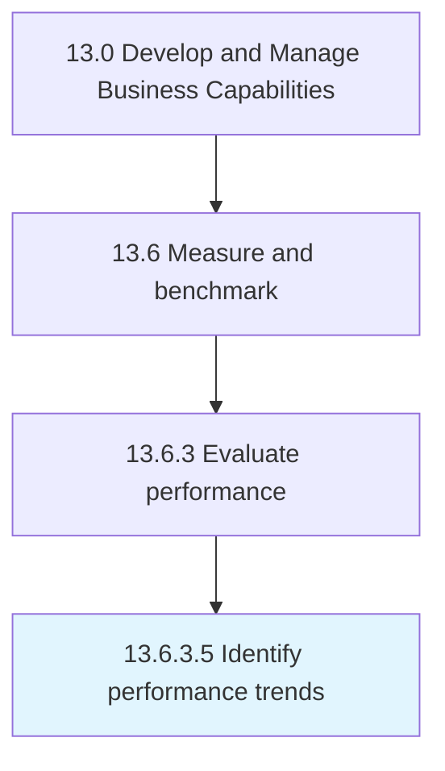

# Identify performance trends

> Recognizing the trends in performance.

## Overview

Activity 13.6.3.5 is an activity within the Develop and Manage Business Capabilities framework. 

Recognizing the trends in performance. Carefully and strategically assess the results in order to effectively spot the trends.

## Process Hierarchy



## Key Statistics

| Metric | Value |
|--------|-------|
| APQC Code | 10273 |
| Hierarchy ID | 13.6.3.5 |
| Level | Activity |
| Parent | [13.6.3](../) |
| Sub-Processes | 0 |


## GraphDL Semantic Structure

```
identify.PerformanceTrends
```

| Component | Value | Description |
|-----------|-------|-------------|
| Verb | `identify` | Primary action |
| Object | `performance trends` | Direct object |


## Related Concepts

- PerformanceTrends


---

*Source: APQC PCF 10273 (13.6.3.5) - APQC*
