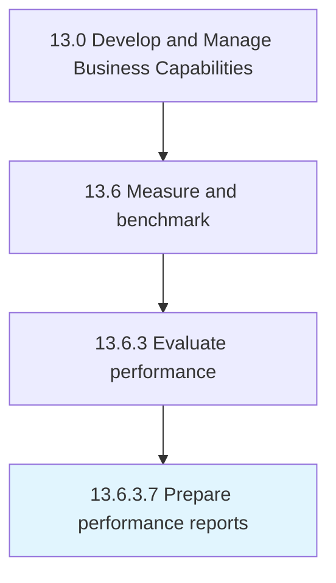

# Prepare performance reports

> Creating reports that systematically record and represent the performance planning.

## Overview

Activity 13.6.3.7 is an activity within the Develop and Manage Business Capabilities framework. 

Creating reports that systematically record and represent the performance planning. Construct a detailed report specifying the performance, and include indicators such as the performance gaps, performance trends, and analysis.

## Process Hierarchy



## Key Statistics

| Metric | Value |
|--------|-------|
| APQC Code | 10275 |
| Hierarchy ID | 13.6.3.7 |
| Level | Activity |
| Parent | [13.6.3](../) |
| Sub-Processes | 0 |


## GraphDL Semantic Structure

```
prepare.PerformanceReports
```

| Component | Value | Description |
|-----------|-------|-------------|
| Verb | `prepare` | Primary action |
| Object | `performance reports` | Direct object |


## Related Concepts

- [PerformanceReports](/concepts/PerformanceReports)


---

*Source: APQC PCF 10275 (13.6.3.7) - APQC*
