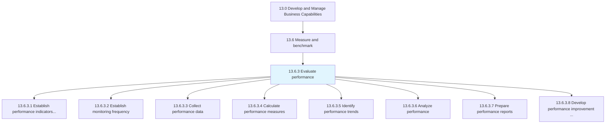
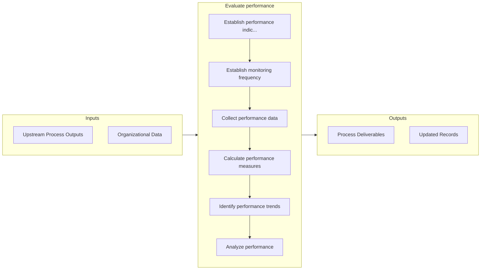

# Evaluate performance

> Assessing process data, measures, and trends in an effort to evaluate process performance and identify possible improvements.

## Overview

Process 13.6.3 is a core process that defines the specific procedures for evaluate performance. 

Assessing process data, measures, and trends in an effort to evaluate process performance and identify possible improvements.

## Process Hierarchy



## Key Statistics

| Metric | Value |
|--------|-------|
| APQC Code | 20147 |
| Hierarchy ID | 13.6.3 |
| Level | Process |
| Parent | [13.6](../) |
| Sub-Processes | 8 |


## GraphDL Semantic Structure

```graphdl
evaluate.Performance
```

| Component | Value | Description |
|-----------|-------|-------------|
| Verb | `evaluate` | Primary action |
| Object | `performance` | Direct object |


## Process Flow



## Sub-Processes

| Process | Hierarchy ID | Description |
|---------|-------------|-------------|
| [Establish performance indicators (measures)](./EstablishPerformanceIndicatorsMeasures) | 13.6.3.1 | Designing key measures that analyze and interpret how effectively the business is achieving its obje |
| [Establish monitoring frequency](./EstablishMonitoringFrequency) | 13.6.3.2 | Deciding on the appropriate amount of supervisions that are needed to effectively assess the perform |
| [Collect performance data](./CollectPerformanceData) | 13.6.3.3 | Consolidating acquired metrics and trends |
| [Calculate performance measures](./CalculatePerformanceMeasures) | 13.6.3.4 | Measuring the performance of process planning |
| [Identify performance trends](./IdentifyPerformanceTrends) | 13.6.3.5 | Recognizing the trends in performance |
| [Analyze performance](./AnalyzePerformance) | 13.6.3.6 | Evaluating the gaps between achieved and benchmarked performance |
| [Prepare performance reports](./PreparePerformanceReports) | 13.6.3.7 | Creating reports that systematically record and represent the performance planning |
| [Develop performance improvement plan](./DevelopPerformanceImprovementPlan) | 13.6.3.8 | Using performance indicators to report, analyze, and create a detailed performance improvement plan  |


## Related Concepts

- Performance


---

*Source: APQC PCF 20147 (13.6.3) - APQC*
