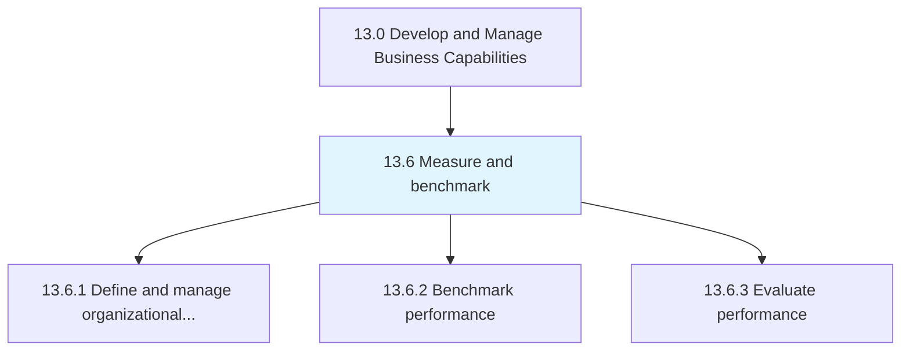
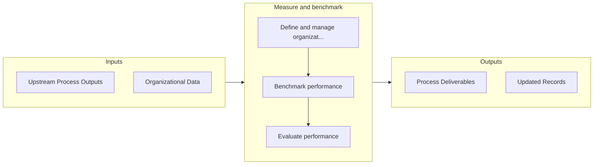

# Measure and benchmark

> Defining and managing measurement and benchmarking.

## Overview

Group 13.6 is a process group within APQC Category 13.0 (Develop and Manage Business Capabilities). 

Defining and managing measurement and benchmarking. Measure and benchmark the performance of internal processes, as well as the organization as a whole.

## Process Hierarchy



## Key Statistics

| Metric | Value |
|--------|-------|
| APQC Code | 21584 |
| Hierarchy ID | 13.6 |
| Level | Group |
| Parent | [13](../) |
| Sub-Processes | 3 |


## GraphDL Semantic Structure

```graphdl
measure.AndBenchmark
```

| Component | Value | Description |
|-----------|-------|-------------|
| Verb | `measure` | Primary action |
| Object | `and benchmark` | Direct object |


## Process Flow



## Sub-Processes

| Process | Hierarchy ID | Description |
|---------|-------------|-------------|
| [Define and manage organizational performance strategy](./13.6.1-DefineManageOrganizationalPerformance/) | 13.6.1 | Creating and implementing a strategy for managing organizational performance |
| [Benchmark performance](./13.6.2-BenchmarkPerformance/) | 13.6.2 | Comparing organizational performance internally or externally with other organizations |
| [Evaluate performance](./13.6.3-EvaluatePerformance/) | 13.6.3 | Assessing process data, measures, and trends in an effort to evaluate process performance and identi |


## Related Concepts

- Benchmark


---

*Source: APQC PCF 21584 (13.6) - APQC*
