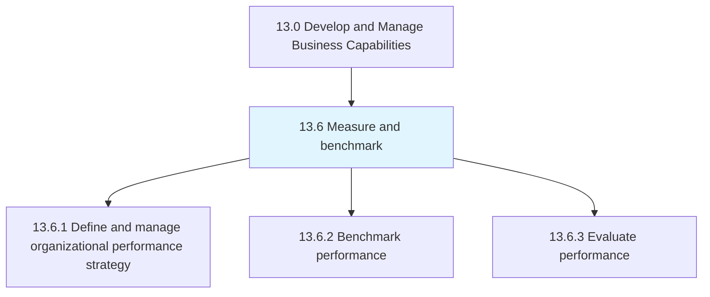
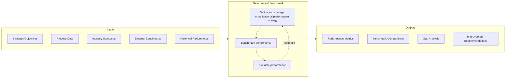
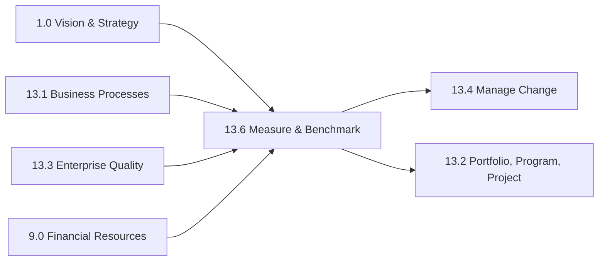

# Measure and benchmark

> Defining and managing measurement and benchmarking.

## Overview

Group 13.6 is a process group within APQC Category 13.0 (Develop and Manage Business Capabilities) that establishes the organizational capability to systematically measure, compare, and improve performance. This process group provides the data-driven foundation for understanding how well the organization is executing against its objectives and how it compares to industry peers and best-in-class performers.

Measurement creates visibility into organizational performance, enabling fact-based decision making and providing early warning of emerging issues. Benchmarking extends this capability by comparing performance against external standards, revealing opportunities for improvement that would not be visible through internal analysis alone. Together, these capabilities form a continuous improvement engine that drives organizational excellence.

This process group supports the broader capability development framework by providing the metrics and comparisons needed to prioritize improvement initiatives, track progress, and demonstrate value. Effective measurement and benchmarking requires a well-designed performance strategy, robust data collection and analysis capabilities, and a culture that values data-driven decision making.

## Process Hierarchy



## Key Statistics

| Metric | Value |
|--------|-------|
| APQC Code | 21584 |
| Hierarchy ID | 13.6 |
| Level | Group |
| Parent | [13](../) |
| Sub-Processes | 3 |


## GraphDL Semantic Structure

```graphdl
measure.AndBenchmark
```

| Component | Value | Description |
|-----------|-------|-------------|
| Verb | `measure` | Primary action |
| Object | `and benchmark` | Direct object |


## Process Flow



## Child Processes

### 13.6.1 Define and Manage Organizational Performance Strategy

Creating and implementing a strategy for managing organizational performance. This process establishes the measurement models, performance indicators, and governance framework that enable systematic performance tracking across the enterprise.

**Key Activities:**
- Define enterprise measurement models and frameworks
- Establish key performance indicators (KPIs) aligned with strategy
- Maintain and update measurement models as needs evolve
- Create balanced scorecard or similar performance framework
- Align metrics with employee and departmental objectives

[View Process Details](./13.6.1-DefineManageOrganizationalPerformance/)

### 13.6.2 Benchmark Performance

Comparing organizational performance internally or externally with other organizations. This process provides the comparative analysis that reveals performance gaps and identifies improvement opportunities based on industry best practices.

**Key Activities:**
- Identify benchmarking partners and data sources
- Collect and normalize comparative data
- Analyze performance gaps and root causes
- Identify best practices from high performers
- Develop improvement recommendations

[View Process Details](./13.6.2-BenchmarkPerformance/)

### 13.6.3 Evaluate Performance

Assessing process data, measures, and trends to evaluate process performance and identify improvement opportunities. This process translates measurement data into actionable insights that drive continuous improvement.

**Key Activities:**
- Analyze performance trends and patterns
- Identify performance gaps and anomalies
- Conduct root cause analysis
- Report performance to stakeholders
- Recommend improvement actions

[View Process Details](./13.6.3-EvaluatePerformance/)


## RACI Matrix

| Activity | Responsible | Accountable | Consulted | Informed |
|----------|-------------|-------------|-----------|----------|
| Define performance strategy | Strategy Team | Chief Strategy Officer | Department Heads | All employees |
| Establish KPIs | Business Analysts | Department Heads | Finance, Operations | Teams |
| Collect performance data | Data Analysts | Business Analysts | IT, Process Owners | Management |
| Conduct benchmarking studies | Performance Team | COO | External partners | Executive team |
| Analyze benchmark results | Business Analysts | Performance Manager | Process Owners | Leadership |
| Report performance | Performance Manager | CFO | Department Heads | Board, All employees |
| Recommend improvements | Business Analysts | COO | Process Owners | Executive team |
| Track improvement actions | Process Owners | Department Heads | Performance Team | Management |


## Metrics and KPIs

| Metric | Description | Target |
|--------|-------------|--------|
| Strategic Alignment Score | Percentage of KPIs aligned with strategic objectives | 100% |
| Data Quality Index | Accuracy and completeness of performance data | >98% |
| Benchmarking Coverage | Percentage of key processes benchmarked | >80% |
| Performance vs. Benchmark | Gap between actual and benchmark performance | Closing trend |
| Reporting Timeliness | Percentage of reports delivered on time | 100% |
| Insight-to-Action Rate | Percentage of insights resulting in improvements | >50% |
| KPI Achievement Rate | Percentage of KPIs meeting targets | >85% |
| Balanced Scorecard Score | Composite organizational performance score | Improving trend |


## Related Departments

- [Executive Office](/departments/Executive) - Strategic direction and performance accountability
- [Finance](/departments/Finance) - Financial metrics and performance reporting
- [Strategy & Planning](/departments/Strategy) - Strategic alignment and planning
- [Operations](/departments/Operations) - Operational metrics and process performance
- [Information Technology](/departments/IT) - Data systems and analytics platforms
- [Human Resources](/departments/HR) - Employee performance metrics


## Related Occupations

- [Management Analysts](/occupations/Business/ManagementAnalysts) - Performance analysis and benchmarking
- [Business Intelligence Analysts](/occupations/Business/BIAnalysts) - Data analysis and visualization
- [Financial Analysts](/occupations/Finance/FinancialAnalysts) - Financial performance analysis
- [Operations Research Analysts](/occupations/Business/OperationsResearch) - Statistical analysis and modeling
- [Data Scientists](/occupations/Technology/DataScientists) - Advanced analytics and insights


## Industry Variations

### Manufacturing

Manufacturing benchmarking focuses on operational efficiency metrics such as OEE (Overall Equipment Effectiveness), cycle time, and quality rates. Industry consortiums and APQC data provide robust benchmarking opportunities. Performance measurement often integrates with manufacturing execution systems (MES).

### Financial Services

Financial services measurement emphasizes risk-adjusted returns, efficiency ratios, and regulatory metrics. Benchmarking includes peer group analysis and regulatory stress testing comparisons. Real-time dashboards monitor trading and operational performance.

### Healthcare

Healthcare measurement focuses on clinical outcomes, patient safety metrics, and financial performance. Benchmarking often uses CMS data, Leapfrog scores, and Joint Commission metrics. Value-based care models require sophisticated outcome measurement.

### Retail

Retail measurement centers on sales performance, inventory metrics, and customer experience scores. Benchmarking includes same-store sales comparisons and market share analysis. E-commerce metrics increasingly dominate performance frameworks.


## Performance Management Frameworks

Organizations may adopt established frameworks:

- **Balanced Scorecard** - Financial, Customer, Process, Learning perspectives
- **OKRs (Objectives and Key Results)** - Goal-setting and measurement framework
- **APQC Process Classification Framework** - Standard process metrics
- **Six Sigma** - Defect and variation metrics
- **Lean Metrics** - Waste reduction and flow metrics


## Benchmarking Approaches

- **Internal Benchmarking** - Comparing across business units or time periods
- **Competitive Benchmarking** - Comparing with direct competitors
- **Functional Benchmarking** - Comparing specific functions with best performers
- **Generic Benchmarking** - Comparing processes across industries
- **Collaborative Benchmarking** - Participating in industry consortiums


## Related Processes



---

*Source: APQC PCF 21584 (13.6) - APQC*
