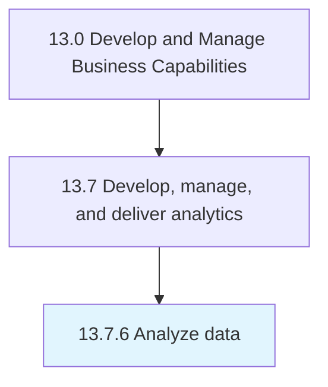

# Analyze data

> Conducting data analysis.

## Overview

Process 13.7.6 is a core process that defines the specific procedures for analyze data. 

Conducting data analysis. Choose statistical algorithms that best reveal patterns and trends in the data. Compare with hypotheses and time series forecasts. Determine error rates and significant outliers.

## Process Hierarchy



## Key Statistics

| Metric | Value |
|--------|-------|
| APQC Code | 20962 |
| Hierarchy ID | 13.7.6 |
| Level | Process |
| Parent | [13.7](../) |
| Sub-Processes | 0 |


## GraphDL Semantic Structure

```
analyze.Data
```

| Component | Value | Description |
|-----------|-------|-------------|
| Verb | `analyze` | Primary action |
| Object | `data` | Direct object |


## Related Concepts

- [Data](/concepts/Data)


---

*Source: APQC PCF 20962 (13.7.6) - APQC*
