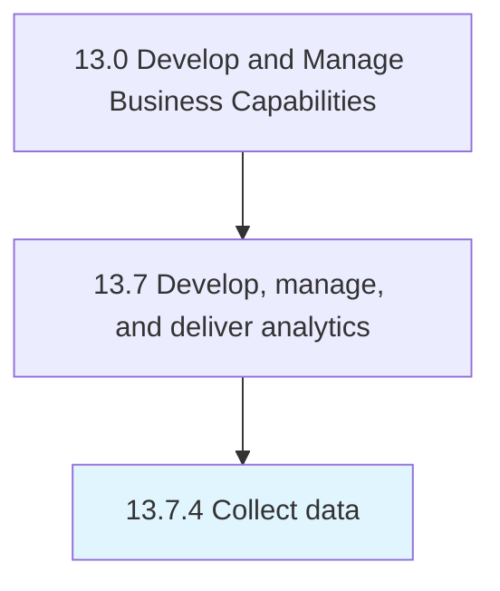

# Collect data

> Gathering and harvesting structured and unstructured data from disparate sources.

## Overview

Process 13.7.4 is a core process that defines the specific procedures for collect data. 

Gathering and harvesting structured and unstructured data from disparate sources. Clean and pre-process data. Remove duplicates. Convert to a uniform format to make records comparable.

## Process Hierarchy



## Key Statistics

| Metric | Value |
|--------|-------|
| APQC Code | 20961 |
| Hierarchy ID | 13.7.4 |
| Level | Process |
| Parent | [13.7](../) |
| Sub-Processes | 0 |


## GraphDL Semantic Structure

```
collect.Data
```

| Component | Value | Description |
|-----------|-------|-------------|
| Verb | `collect` | Primary action |
| Object | `data` | Direct object |


## Related Concepts

- Data


---

*Source: APQC PCF 20961 (13.7.4) - APQC*
