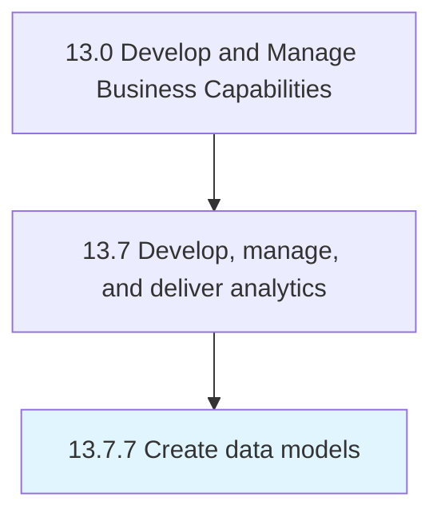

# Create data models

> Creation of conceptual and physical data models as an outline for data structure and storage.

## Overview

Process 13.7.7 is a core process that defines the specific procedures for create data models. 

Creation of conceptual and physical data models as an outline for data structure and storage.

## Process Hierarchy



## Key Statistics

| Metric | Value |
|--------|-------|
| APQC Code | 21462 |
| Hierarchy ID | 13.7.7 |
| Level | Process |
| Parent | [13.7](../) |
| Sub-Processes | 0 |


## GraphDL Semantic Structure

```
create.DataModels
```

| Component | Value | Description |
|-----------|-------|-------------|
| Verb | `create` | Primary action |
| Object | `data models` | Direct object |


## Related Concepts

- DataModels


---

*Source: APQC PCF 21462 (13.7.7) - APQC*
