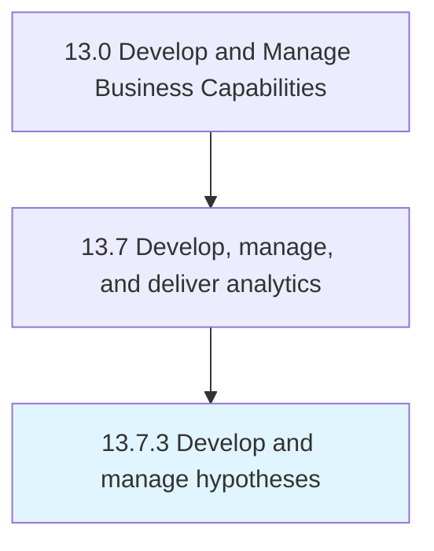

# Develop and manage hypotheses

> Creating theories that explain empirical data.

## Overview

Process 13.7.3 is a core process that defines the specific procedures for develop and manage hypotheses. 

Creating theories that explain empirical data. Use the hypotheses to guide feature selection in the process of data collection.

## Process Hierarchy



## Key Statistics

| Metric | Value |
|--------|-------|
| APQC Code | 20960 |
| Hierarchy ID | 13.7.3 |
| Level | Process |
| Parent | [13.7](../) |
| Sub-Processes | 0 |


## GraphDL Semantic Structure

```
develop.AndManageHypotheses
```

| Component | Value | Description |
|-----------|-------|-------------|
| Verb | `develop` | Primary action |
| Object | `and manage hypotheses` | Direct object |


## Related Concepts

- Hypotheses
- Hypotheses


---

*Source: APQC PCF 20960 (13.7.3) - APQC*
