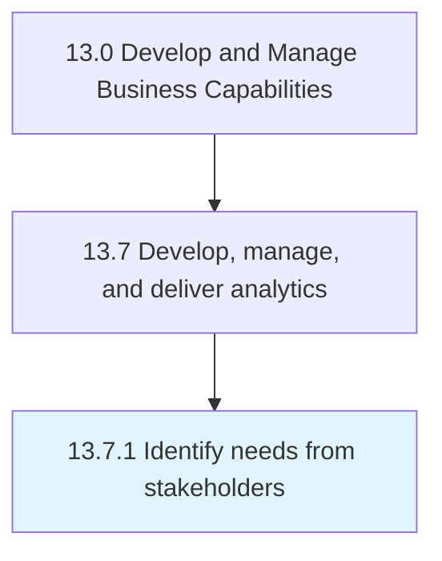

# Identify needs from stakeholders

> Gathering information from stakeholders prior to conducting analytics.

## Overview

Process 13.7.1 is a core process that defines the specific procedures for identify needs from stakeholders. 

Gathering information from stakeholders prior to conducting analytics.

## Process Hierarchy



## Key Statistics

| Metric | Value |
|--------|-------|
| APQC Code | 21459 |
| Hierarchy ID | 13.7.1 |
| Level | Process |
| Parent | [13.7](../) |
| Sub-Processes | 0 |


## GraphDL Semantic Structure

```
identify.Needs.from.Stakeholders
```

| Component | Value | Description |
|-----------|-------|-------------|
| Verb | `identify` | Primary action |
| Object | `needs` | Direct object |
| Preposition | `from` | Relationship |
| PrepObject | `stakeholders` | Indirect object |


## Related Concepts

- [Needs](/concepts/Needs)
- [Stakeholders](/concepts/Stakeholders)


---

*Source: APQC PCF 21459 (13.7.1) - APQC*
