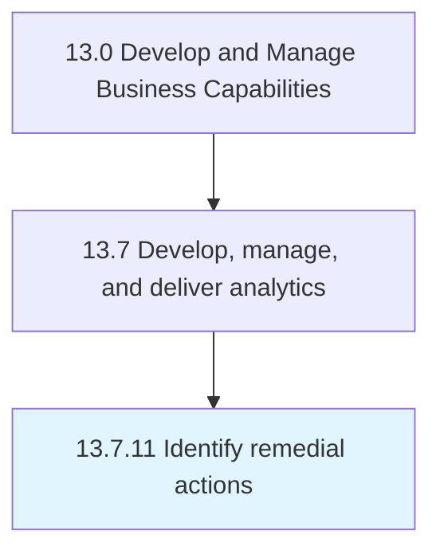

# Identify remedial actions

> Determining the steps that need to be taken to correct the shortcomings.

## Overview

Process 13.7.11 is a core process that defines the specific procedures for identify remedial actions. 

Determining the steps that need to be taken to correct the shortcomings.

## Process Hierarchy



## Key Statistics

| Metric | Value |
|--------|-------|
| APQC Code | 20964 |
| Hierarchy ID | 13.7.11 |
| Level | Process |
| Parent | [13.7](../) |
| Sub-Processes | 0 |


## GraphDL Semantic Structure

```
identify.RemedialActions
```

| Component | Value | Description |
|-----------|-------|-------------|
| Verb | `identify` | Primary action |
| Object | `remedial actions` | Direct object |


## Related Concepts

- [RemedialActions](/concepts/RemedialActions)


---

*Source: APQC PCF 20964 (13.7.11) - APQC*
