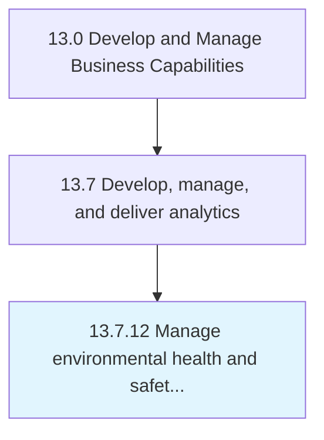

# Manage environmental health and safety (EHS)

> Determining the impacts of environmental health and safety.

## Overview

Process 13.7.12 is a core process that defines the specific procedures for manage environmental health and safety (ehs). 

Determining the impacts of environmental health and safety. Create and implement the EHS program. Train and educate employees of the EHS function. Oversee and manage the EHS program.

## Process Hierarchy



## Key Statistics

| Metric | Value |
|--------|-------|
| APQC Code | 11179 |
| Hierarchy ID | 13.7.12 |
| Level | Process |
| Parent | [13.7](../) |
| Sub-Processes | 0 |


## GraphDL Semantic Structure

```
manage.EnvironmentalHealthAndSafetyEHS
```

| Component | Value | Description |
|-----------|-------|-------------|
| Verb | `manage` | Primary action |
| Object | `environmental health and safety (EHS)` | Direct object |


---

*Source: APQC PCF 11179 (13.7.12) - APQC*
