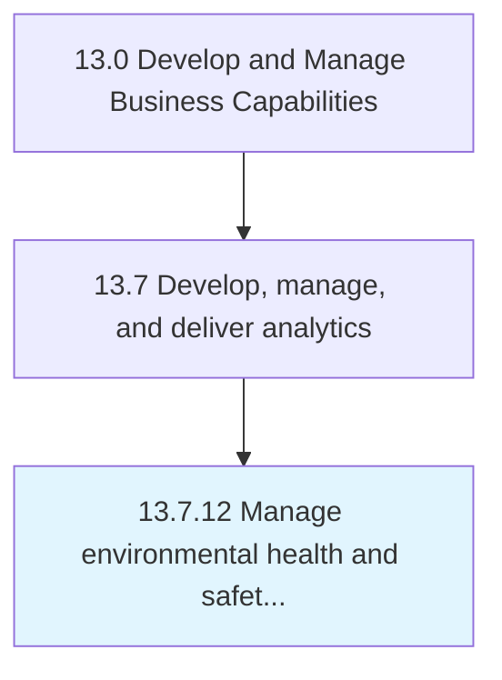

# Manage environmental health and safety (EHS)

> Determining the impacts of environmental health and safety.

## Overview

The manage environmental health and safety (ehs) process is a critical component of the Business Capabilities function within an organization. It encompasses the systematic approach to manage environmental health and safety (ehs), ensuring that all activities are performed consistently, efficiently, and in alignment with organizational objectives. This process establishes the framework through which manage environmental health and safety (ehs) is executed, monitored, and continuously improved to deliver value across the enterprise.

Within the APQC Process Classification Framework (hierarchy 13.7.12), this process supports the broader "Develop and Manage Business Capabilities" category. Effective execution requires cross-functional collaboration, clear accountability, and robust governance mechanisms. Organizations that mature this process typically see improved operational performance, reduced risk exposure, and stronger alignment between tactical activities and strategic goals.


## Process Hierarchy


```mermaid
graph TD
    C13["13.0 Develop and Manage Business Capabilities"]
    C13 --> N13_7["13.7 Develop, manage, and deliver analytics"]
    N13_7 --> N13_7_12["13.7.12 Manage environmental health and safet..."]
    style N13_7_12 fill:#e1f5fe
```

## Key Statistics

| Metric | Value |
|--------|-------|
| APQC Code | 11179 |
| Hierarchy ID | 13.7.12 |
| Level | Process |
| Parent | [13.7](../) |
| Sub-Processes | 0 |


## GraphDL Semantic Structure

```
manage.EnvironmentalHealthAndSafetyEHS
```

| Component | Value | Description |
|-----------|-------|-------------|
| Verb | `manage` | Primary action |
| Object | `environmental health and safety (EHS)` | Direct object |


---

*Source: APQC PCF 11179 (13.7.12) - APQC*
