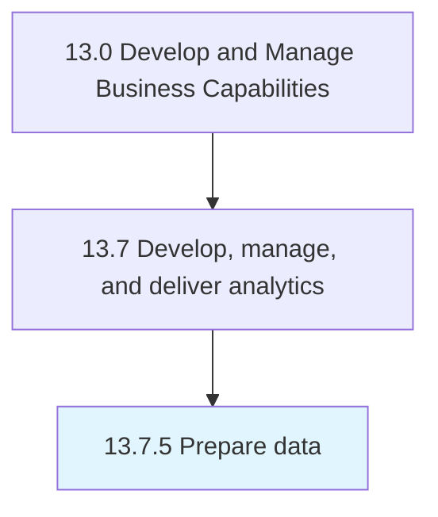

# Prepare data

> Creation and validation of data in order to initiate the process of analysis.

## Overview

Process 13.7.5 is a core process that defines the specific procedures for prepare data. 

Creation and validation of data in order to initiate the process of analysis.

## Process Hierarchy



## Key Statistics

| Metric | Value |
|--------|-------|
| APQC Code | 21461 |
| Hierarchy ID | 13.7.5 |
| Level | Process |
| Parent | [13.7](../) |
| Sub-Processes | 0 |


## GraphDL Semantic Structure

```
prepare.Data
```

| Component | Value | Description |
|-----------|-------|-------------|
| Verb | `prepare` | Primary action |
| Object | `data` | Direct object |


## Related Concepts

- Data


---

*Source: APQC PCF 21461 (13.7.5) - APQC*
