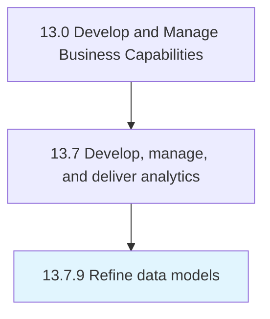

# Refine data models

> Make required changes to data model based upon review with stakeholders.

## Overview

Process 13.7.9 is a core process that defines the specific procedures for refine data models. 

Make required changes to data model based upon review with stakeholders.

## Process Hierarchy



## Key Statistics

| Metric | Value |
|--------|-------|
| APQC Code | 21464 |
| Hierarchy ID | 13.7.9 |
| Level | Process |
| Parent | [13.7](../) |
| Sub-Processes | 0 |


## GraphDL Semantic Structure

```
refine.DataModels
```

| Component | Value | Description |
|-----------|-------|-------------|
| Verb | `refine` | Primary action |
| Object | `data models` | Direct object |


## Related Concepts

- [DataModels](/concepts/DataModels)


---

*Source: APQC PCF 21464 (13.7.9) - APQC*
