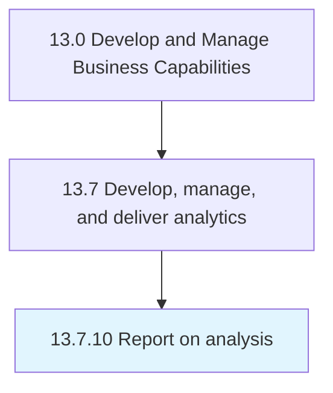

# Report on analysis

> Summarizing and documenting the results of data analysis.

## Overview

Process 13.7.10 is a core process that defines the specific procedures for report on analysis. 

Summarizing and documenting the results of data analysis. Create graphs and visualizations to illustrate numerical findings to make them more accessible to readers.

## Process Hierarchy



## Key Statistics

| Metric | Value |
|--------|-------|
| APQC Code | 20963 |
| Hierarchy ID | 13.7.10 |
| Level | Process |
| Parent | [13.7](../) |
| Sub-Processes | 0 |


## GraphDL Semantic Structure

```
report.OnAnalysis
```

| Component | Value | Description |
|-----------|-------|-------------|
| Verb | `report` | Primary action |
| Object | `on analysis` | Direct object |


## Related Concepts

- Analysis


---

*Source: APQC PCF 20963 (13.7.10) - APQC*
