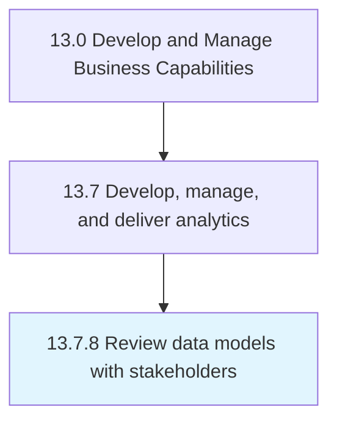

# Review data models with stakeholders

> Confirm data models represent the hypothesis supporting the original research question.

## Overview

Process 13.7.8 is a core process that defines the specific procedures for review data models with stakeholders. 

Confirm data models represent the hypothesis supporting the original research question

## Process Hierarchy



## Key Statistics

| Metric | Value |
|--------|-------|
| APQC Code | 21463 |
| Hierarchy ID | 13.7.8 |
| Level | Process |
| Parent | [13.7](../) |
| Sub-Processes | 0 |


## GraphDL Semantic Structure

```
review.DataModels.with.Stakeholders
```

| Component | Value | Description |
|-----------|-------|-------------|
| Verb | `review` | Primary action |
| Object | `data models` | Direct object |
| Preposition | `with` | Relationship |
| PrepObject | `stakeholders` | Indirect object |


## Related Concepts

- [DataModels](/concepts/DataModels)
- [Stakeholders](/concepts/Stakeholders)


---

*Source: APQC PCF 21463 (13.7.8) - APQC*
