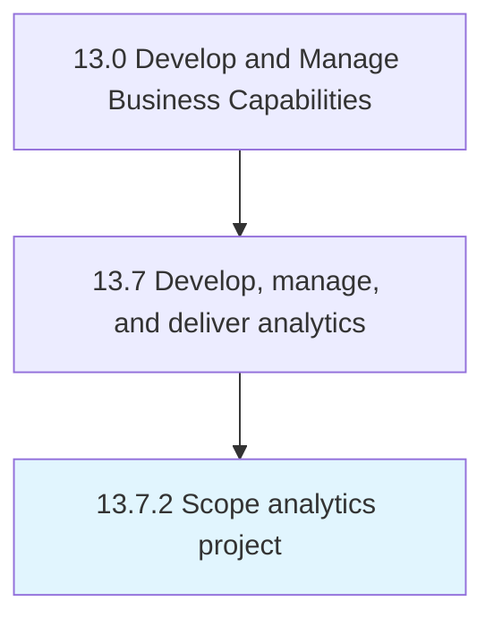

# Scope analytics project

> Determining the size and scale of the project based upon the collected information and analytics.

## Overview

Process 13.7.2 is a core process that defines the specific procedures for scope analytics project. 

Determining the size and scale of the project based upon the collected information and analytics.

## Process Hierarchy



## Key Statistics

| Metric | Value |
|--------|-------|
| APQC Code | 21460 |
| Hierarchy ID | 13.7.2 |
| Level | Process |
| Parent | [13.7](../) |
| Sub-Processes | 0 |


## GraphDL Semantic Structure

```
scope.AnalyticsProject
```

| Component | Value | Description |
|-----------|-------|-------------|
| Verb | `scope` | Primary action |
| Object | `analytics project` | Direct object |


## Related Concepts

- [AnalyticsProject](/concepts/AnalyticsProject)


---

*Source: APQC PCF 21460 (13.7.2) - APQC*
